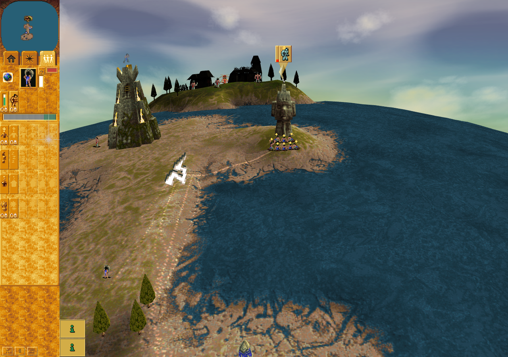

# Public pre-worship checkpoint and flight resize

Accepted bounded candidate row at application `cfa86a32f03d021cd1ad725eed9f458ab239d56b`,
driver `e85cabfa7fbf3d4202b2261985f1d3ad5575d60c`. The ordinary Bridge crossing precedes
a public paused Save at turn 738. Fresh-page public Load preserves the observed
checkpoint identity/full digest, automatically resumes, and leaves the stored save
unchanged. This checkpoint is **before the Lightning worship order**; it is not an
in-flight acquisition restore or a second-browser-process continuation.

A subsequent real ordinary Lightning worship order reaches handoff 1066. During
its flight the actual viewport changes from 1440 × 1000 to 1280 × 900 and the player
switches to Followers. Rendered mapping updates while immutable logical geometry
stays unchanged. Arrival 1082 reopens Spells and clamps the real gift; exactly one
stock/count payout follows at 1083. Presentation owners and overlay retire.

The run retains callback-observed rotated, intermediate and resized body output,
canonical Lightning frame decode, exact original Canvas inputs and unchanged matrix/
draw-argument thresholds. Zero eligible opaque destination texels were sampled,
explicitly unproved. One cue, no page/observer errors or acquisition diagnostics,
unchanged source/runtime, terminal harness/outer pass and verified owned cleanup.

Sandboxed official Chrome Headless Shell 154.0.8037.92/SwiftShader, DPR 1 and four
CPU affinity slots. These are actual software-browser pixels and bounded source
binding, not full raster/native GPU/hardware-performance or whole-PR acceptance.
The composite is host-stage context, not an exact callback-turn guarantee. See the
independent review and portable source-bound receipts. No game/tool binaries,
dependency tree or browser profile is distributed.
