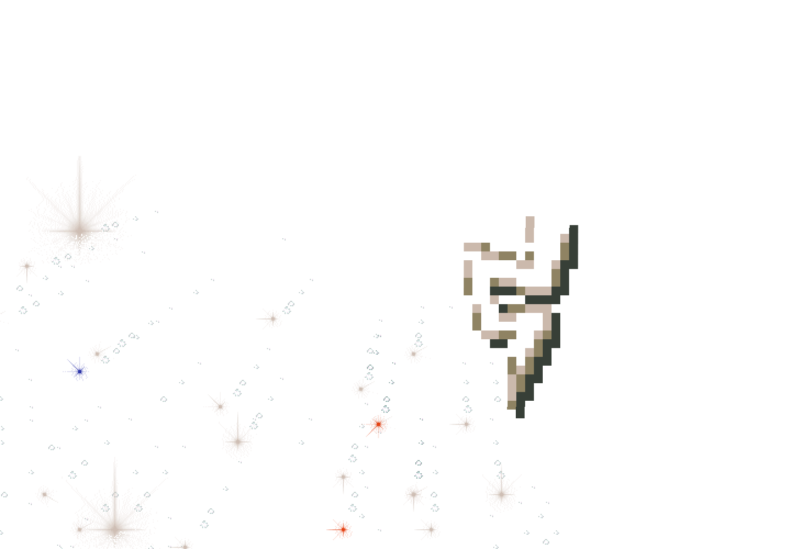

# Ordinary active-flight Load in a second browser process

Accepted second half of the [active-flight Save pair](../m1-flight-save/README.md)
at application `cfa86a32f03d021cd1ad725eed9f458ab239d56b`, boundary checker
`66aba0c1c4e4f13fec2cd670dea0889409292610`. The prior raw receipt hash is verified,
and the same stored turn-1051 checkpoint is read independently before public Load.
Its exact acquisition, gift, stock, RNG and UI deadline fields survive replacement
and are captured before the new scene's first RAF. Public Load automatically resumes.

An original unpaused worshipVisit moves saved gift 3751 from (410,273) to (410,275).
The actual first restored Canvas output is nontransparent. The pending gift pays
exactly once, emits no acquisition-cue replay and fully retires body, companion,
pulse, commands and gift. The stored checkpoint remains unchanged. The crop's
alpha region can include companion sprites; it is not a complete raster oracle.

Both original terminal receipts and raw logs, shared frozen source/runtime and
owned cleanup were independently reviewed. Chrome Headless Shell 154 / SwiftShader,
CPU 0–3. This pair proves a visible hold and fresh-process auto-resume; same-instance
manual Resume and a saved pulse tail retain separate acceptance. The earlier Load2
failed before Load at a JSON Infinity comparison and remains failed.
