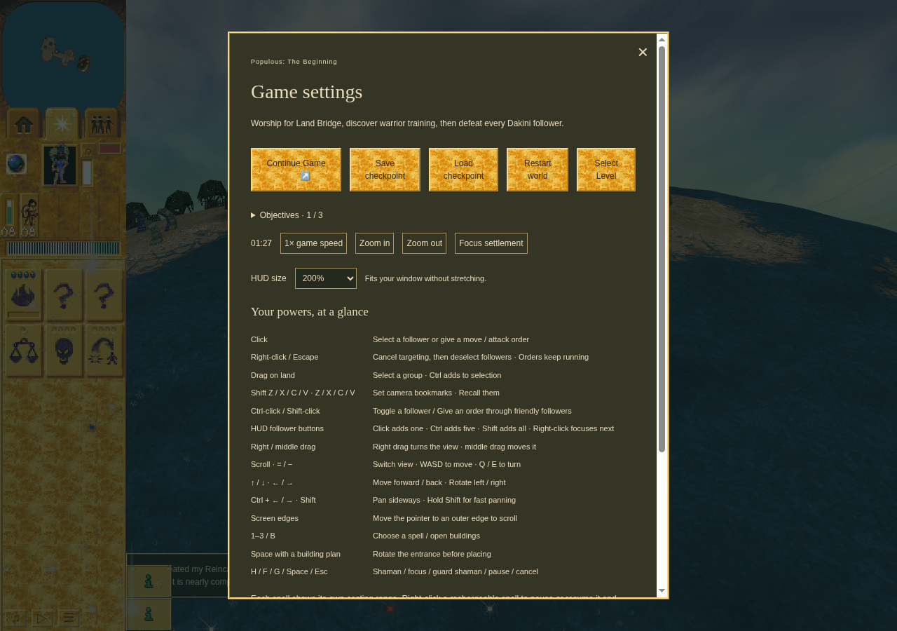

# Ordinary active-flight Save and display continuity

Accepted first half of the [second-process Load pair](../m1-flight-load/README.md)
at application `cfa86a32f03d021cd1ad725eed9f458ab239d56b`, boundary checker
`66aba0c1c4e4f13fec2cd670dea0889409292610`. The real M1 Bridge crossing and ordinary
Lightning worship precede the active-flight public Pause and Save at turn 1051.
The body holds while visible UI time advances. Actual public HUD scaling and
1280 × 900 / emulated DPR 2 backing changes preserve logical geometry and bind the
body's rendered scale to the measured card. Original display metrics are restored.

The paired Load uses the same frozen source, runtime, origin and owned profile in
a fresh browser process. Typed observation tags preserve the real infinite gift
duration across receipt JSON; World and IndexedDB values are untouched. Checkpoint
identity and all focused acquisition, gift, RNG and deadline fields remain exact.
This is a visible hold followed by restored auto-resume. It does not establish
same-instance manual Resume or a pulse-tail checkpoint.

All source/runtime hashes and terminal cleanup passed and were independently
reviewed. Chrome Headless Shell 154 / SwiftShader, CPU 0–3: software functionality
and actual pixels, not physical display, full raster or hardware performance.
Earlier failed Save1 and Load2 remain failed; passed Save2 is not this pair.
