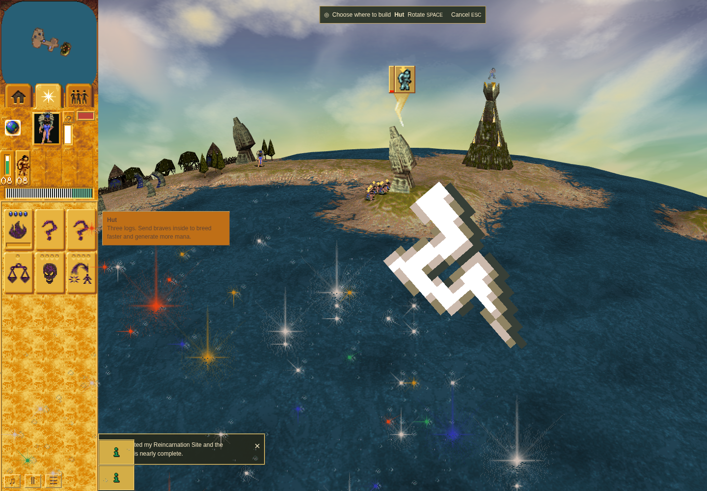

# Ordinary Mission 1 Lightning acquisition

**Accepted bounded candidate row**, application `cfa86a32f03d021cd1ad725eed9f458ab239d56b`,
driver `e85cabfa7fbf3d4202b2261985f1d3ad5575d60c`. Terminal harness and outer command
passed with unchanged source/runtime, no page errors, and verified owned cleanup.

The Shaman earns Land Bridge at the authored head, moves to the shore, and spends
that stock through the public HUD/canvas cast. The actual terrain controller is
observed and retires. The resulting terrain supports a path to Lightning; a trusted
public order assigns eight Braves and ordinary worship produces its gift. This
does not claim each of the eight was individually observed arriving. No World,
terrain, controller, RNG or clock injection or manual stepping is used.

Lightning handoff occurs at turn 1034, arrival clamps at 1050, and exactly one
ordinary stock/count payout follows at 1051. The measured Spells card opens while
Hut mode is retained; body, companion, pulse and overlay retire without diagnostics.

The PNG is a host-stage screenshot in sandboxed official Chrome Headless Shell
154.0.8037.92/SwiftShader at 1440 × 1000, DPR 1 and four CPU affinity slots. Actual
Canvas inputs/matrix representation and canonical frame 1059 decode pass. Zero
eligible opaque destination texels were sampled in this run, explicitly unproved.
These are software-renderer pixels and source binding, not an independent full
raster oracle, original GPU output or hardware-performance result.

The accepted genuine before/after pair is [the separate Bridge row](../m1-bridge/README.md).
This folder contains no Lightning baseline claim and does not complete the PR or
remaining matrix. Prior failed runs remain failed. See the independent review and
source-bound portable receipts for exact assertions, routes and limitations.
No game data, tool binaries, dependency trees or browser profiles are included.
