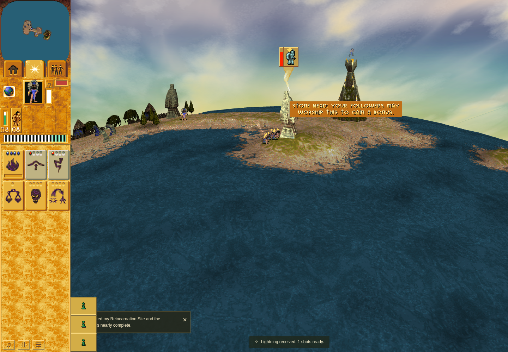

# Explicit missing-geometry fault after ordinary worship

Accepted exceptional-path row at application `cfa86a32f03d021cd1ad725eed9f458ab239d56b`,
checker `7c7d483b47955e3cc55d635fd323b596d973b399`. A real Bridge crossing and public
Lightning worship produce the positive-phase gift. The test then deliberately
sets display:none on the actual HUD, preventing handoff geometry. This DOM fault
is explicitly staged; it is not the normal acquisition path.

Gift 3753/model 3 emits one handoff-geometry diagnostic at turn 1038. The complete
inactive Bridge controller state remains identical through the failed request,
ordinary countdown, payout and restoration. The gift's remaining 81 at turn 1033
reaches exactly one stock/count payout at 1114. Restoration returns the same HUD,
its original absent style attribute exactly null, and its positive 200/100 CSS
bounds. Twelve further object turns through 1126 produce no late initialization,
duplicate payout, extra cue or diagnostic; overlay and requests remain retired.

Earlier fault1 and fault2 stay failed; fault3 failed its detached DOM preflight
before gameplay. A 16-case pinned-browser DOM probe isolated lazy style-attribute
synchronization: clearing the introduced display property, reading the attribute,
then removing it preserves exact absence. Both detached/attached probe cases and
this actual HUD restore satisfy strict null equality. No application behavior or
assertion tolerance changed to obtain this pass.

Source/runtime fingerprints, raw logs, observer restoration, terminal cleanup,
continuation and the retained PNG were independently reviewed. Sandboxed Chrome
Headless Shell 154 / SwiftShader, 1440×1000, DPR 1, CPUs 0–3. This is bounded fault-path
and rendered-restoration evidence, not a full raster or hardware-performance claim.
