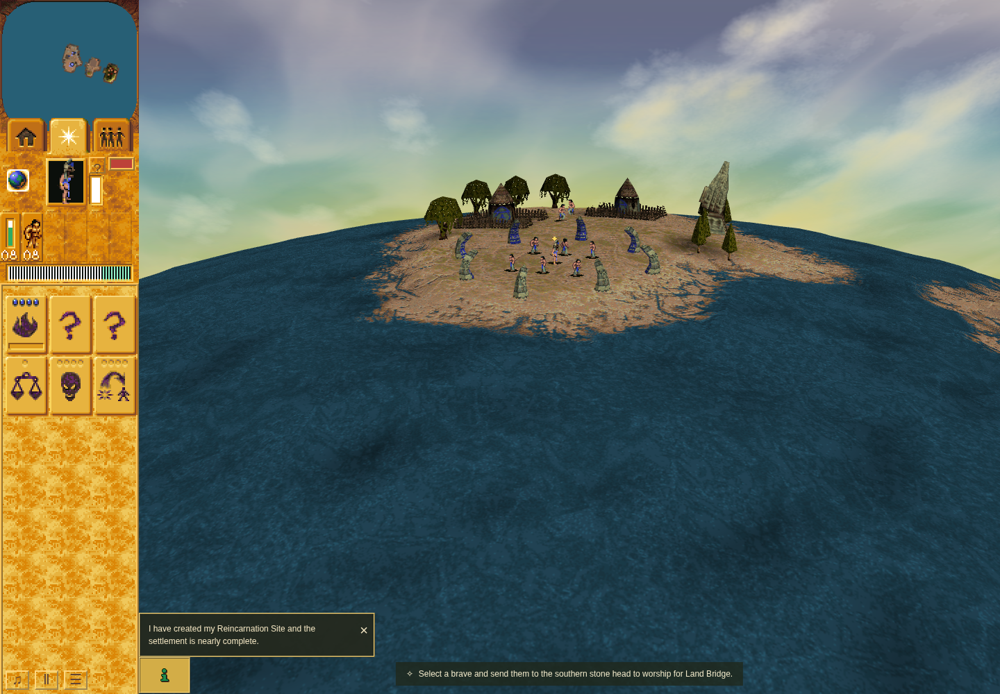

# Public Restart during ordinary acquisition

Accepted at application `cfa86a32f03d021cd1ad725eed9f458ab239d56b`, boundary checker
`66aba0c1c4e4f13fec2cd670dea0889409292610`. A real Bridge crossing and ordinary
Lightning acquisition precede public Settings → Restart at active-flight turn 1060.

The old scene is disposed, its overlay disconnects and its cached sprites, anchors
and prior-particle mappings clear. A distinct World and scene own one connected new
overlay. Before the first RAF, the complete acquisition state matches the original
startup state. Public introduction handling restores ordinary readiness, and turns
continue to 121 without cue, gift, payout or controller replay.

Original raw receipts, logs, stable source/runtime, observer restoration and owned
cleanup passed independent review. Chrome Headless Shell 154 / SwiftShader on CPU
0–3. This is actual application disposal through Restart; it is not a heap benchmark,
full raster oracle or proof of the other boundary rows.
