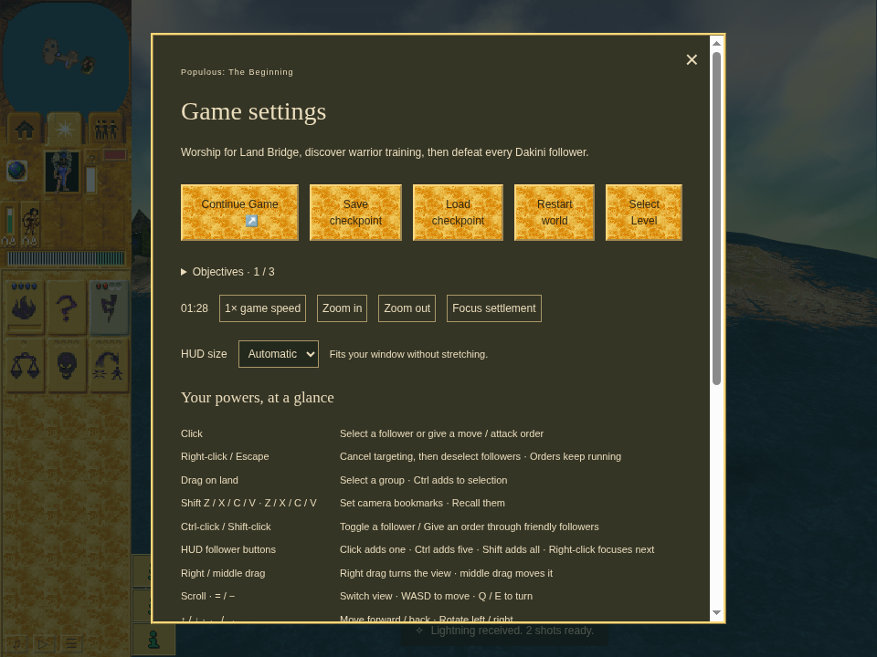

# Accepted genuine pulse-only Save

Accepted first half of the [fresh-process pulse Load pair](../m1-tail-load/README.md)
at application `cfa86a32f03d021cd1ad725eed9f458ab239d56b`, checker
`67d195cb0ea76615d797ba09e10259fda6a1cbec`.

The real ordinary M1 route earns and spends Bridge, then orders Lightning worship.
A normal trusted Settings press is held while ordinary simulation continues. Its
release and the next trusted Save click both reach an independent model-3 pulse
with three visits remaining, with the same gift 3756 and shared geometry. Spell
and companion are inactive. The actual committed checkpoint at turn 1056 retains
that tail, all acquisition/gift/RNG state and the original clock residual.

The hold spans naturally repeated ordinary acquisition: the saved stock and gift
count are both 2. There is no single-total-reward claim, injected gift, callback
Save, artificial timer extension or World/clock rewrite. The paired Load must
preserve those exact values. All trusted pointer/click ownership, menu state and
committed eligibility assertions pass. Earlier failed tail attempts remain failed.

Save uses 960 × 720 / DPR 1. The second browser process restores at 1440 × 1000,
so this is also restore across layout sizes. Official sandboxed Chrome Headless
Shell 154 / SwiftShader and CPUs 0–3. Source/runtime stability, previous receipt
identity, owned cleanup and continuation are independently reviewed. This is
bounded actual tail checkpoint evidence, without a complete raster or hardware
performance claim.
