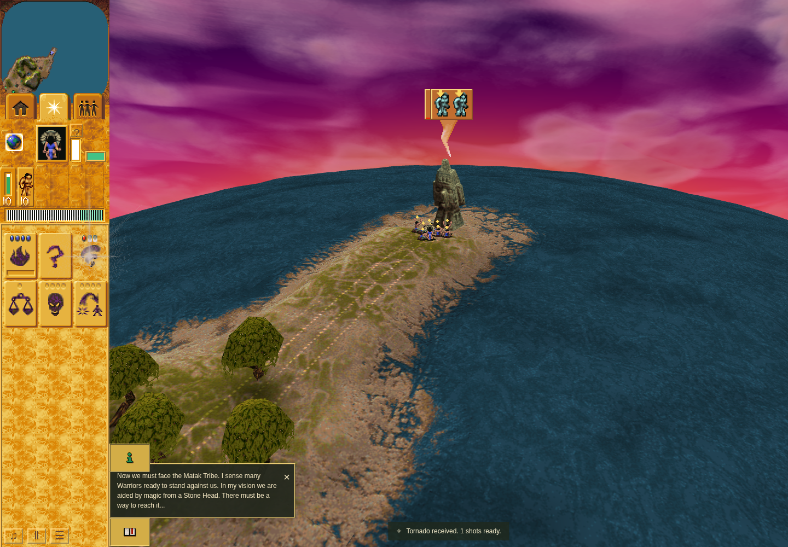

# Ordinary Mission 2 Tornado acquisition

Accepted bounded candidate row at application `cfa86a32f03d021cd1ad725eed9f458ab239d56b`,
driver `e85cabfa7fbf3d4202b2261985f1d3ad5575d60c`. Stable source/runtime, terminal
harness/outer command pass, no page/observer errors and verified owned cleanup.

Three actual input-ready public orders cover the playable route: Shaman worship at
the authored terrain-bridge head, then Shaman and Brave worship at the ordinary
Tornado head. The real terrain prerequisite completes and the normal authored
Tornado reward reaches handoff turn 1254, arrival clamp 1270, and exactly one next
object-turn stock/count payout 1271. The ordinary path is distinct from static
native/controller proof and uses no World, terrain, clock or RNG injection.

Automatic handoff mounts the measured Spells card and preserves Hut mode. Public
Followers-tab interruption during flight is followed by arrival reopening Spells;
body, companion, pulse and overlay retire without diagnostics. Exact original
Canvas primitive inputs, represented matrices, draw arguments and immutable geometry
pass, including genuine between-visit interpolation and native rotation branches.

Canonical frame 1060 decodes to the pinned original RGBA hash. Eight opaque
source/destination texels in the retained zero-angle overlay PNG were independently
decoded and verified exactly. That bounded sampling does not prove every raster
pixel, alpha/tint/ghost ordering or original GPU behavior.

Sandboxed official Chrome Headless Shell 154.0.8037.92/SwiftShader, 1440 × 1000,
DPR 1, four CPU affinity slots, fresh game-only profile and real RAF. The composite
is host-stage context, not a claim of exact callback-turn timing. Camera focus
assistance is recorded per order. No hardware frame/FPS or full-PR acceptance claim.

See the independent review, source-bound redacted receipt, command summary and
frozen checker sources. No game/tool binaries, dependencies or profiles are included.
The genuine baseline/candidate comparison is the separate [Bridge pair](../m1-bridge/README.md).
