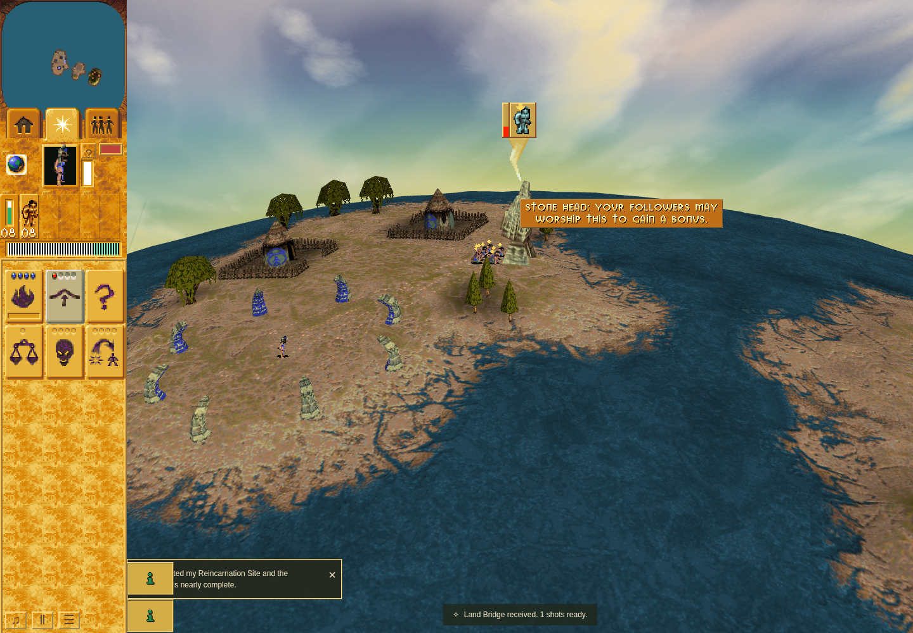

# Accepted bounded software draw-cost observation

Accepted at application `cfa86a32f03d021cd1ad725eed9f458ab239d56b`, checker
`fa0ec9806a0259f1f7845b870dc62210142bd745`. Two fresh ordinary M1 Bridge
acquisitions are separated by one public Restart. Each starts at zero stock/count,
earns exactly one reward through public worship, fully retires its presentation
and restores observation wrappers. Restart replaces the World/scene and disposes
the old overlay before the second round.

Each round retains eight idle warmups, 32 idle samples and eight active warmups.
Their 16/17 eligible active calls yield 8/9 retained samples, 17 in total, meeting
the unchanged minimum 16 and staying below the maximum 128. The shared 180-second
scenario deadline is unchanged; the complete harness run takes about 119 seconds.
All recorded original draws measure each distinct geometry reference exactly once.

| Retained calls | Count | Median | p95 | Maximum | Zero durations |
| --- | ---: | ---: | ---: | ---: | ---: |
| Idle | 64 | 0 ms | about 0.1 ms | about 0.1 ms | 58 |
| Active | 17 | about 0.2 ms | about 0.8 ms | about 0.9 ms | 4 |

Every raw duration and acquisition/category/reference identity is preserved,
including timer-quantized zeros. The interval brackets only original overlay draw;
its minimal geometry-measure counter remains inside. State snapshots, screenshots,
Canvas interception and summary statistics are outside the measured interval.
The one screenshot occurs after every measured call and wrapper restoration.

This is a bounded aggregate across separate ordinary acquisitions, not a same-World
sustained workload, total frame time, hardware FPS/frame-budget result, or a
before/after speedup comparison. Browser: sandboxed Chrome Headless Shell 154 /
SwiftShader, 1440 × 1000 / DPR 1, CPUs 0–3 on a shared AMD EPYC 9V74 cloud host.
No competing owned browser/package/native measurement ran during the row; the
shared host itself is not represented as isolated benchmark hardware.

Exact source/runtime, public Restart identity, all outcome/retirement checks,
raw sample sufficiency, observer restoration and owned cleanup/continuation pass
independent review. Earlier cost1 remains failed for its six active samples.
