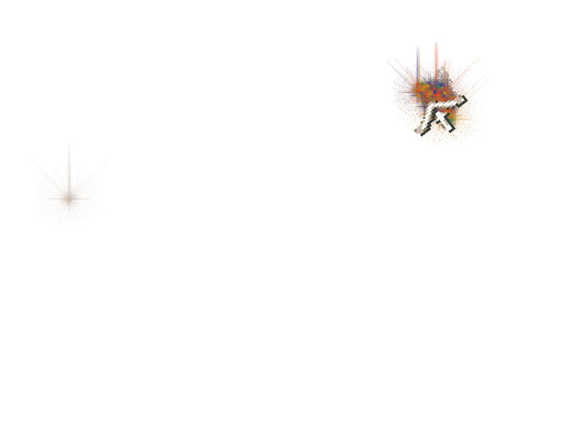

# Staged old-pulse/new-body composition remains incomplete

**FAILED row. The required first mismatched-binding Canvas draw is unproved.**
Application `cfa86a32f03d021cd1ad725eed9f458ab239d56b`, staged checker
`aa2114b6f71abbc9b34b8cae97914bbe221d91e0`, real 960 × 720 / DPR 1,
sandboxed Chrome Headless Shell 154 / SwiftShader, CPUs 0–3.

This is a deliberately staged adapter composition, with three declared gift
creations and phase/remaining overrides in two audited transactions. It does not
claim natural simultaneous worship. The original clock, request drain, React HUD
bridge and Canvas renderer own subsequent behavior. The older pulse is Lightning;
it is not a literal replay of the native ready-pair case's Tornado pulse.

The first replacement visit contains the old model-3 prior and new model-12 body.
By the first real draw, model 12 already owns both current and prior state. Eight
bounded draw observations confirm that the mismatch window passed between native
visits before rendering. Each exact rest-of-World setup audit took about 107 ms,
exceeding two 50 ms UI intervals. Reducing the viewport did not expose the missing
draw. No cap, pixel expectation or mandatory sample assertion was weakened.

Useful partial observations remain explicitly tied to this failed row:

- The real intermediate and final-leg samples bind distinct keyed Lightning and
  Bridge cards and preserve the complete observed state across original drawing.
- Both frames retain actual sprite submission order, primitive inputs and image/
  frame/alpha/destination mapping; 190 changed matching-prior particle slots
  interpolate. The late old pulse has no earlier particle slots for a foreign-
  geometry particle comparison, which remains source/controller-covered only.
- Three opaque ghost-source/returned texels and three meaningful tinted texels
  independently match the canonical effects decode. Actual ghost alpha is 85/255.
- All three fixture gifts pay exactly once. Retirement at turn 214 remains clean
  through turn 216. There are no observer errors, and original wrappers restore.

The mandatory new-binding body sample and its opaque destination texels were not
observed. Zero eligible opaque body destination samples remain unproved. These
partial sprite/body/payout observations do not convert the row into a pass or
establish full raster equivalence. The independent review retains that blocker;
the [separate immutable-audit successor](../staged-composition/README.md) subsequently passed independent review. The original process exited 1 normally
with verified owned cleanup and continuation.
