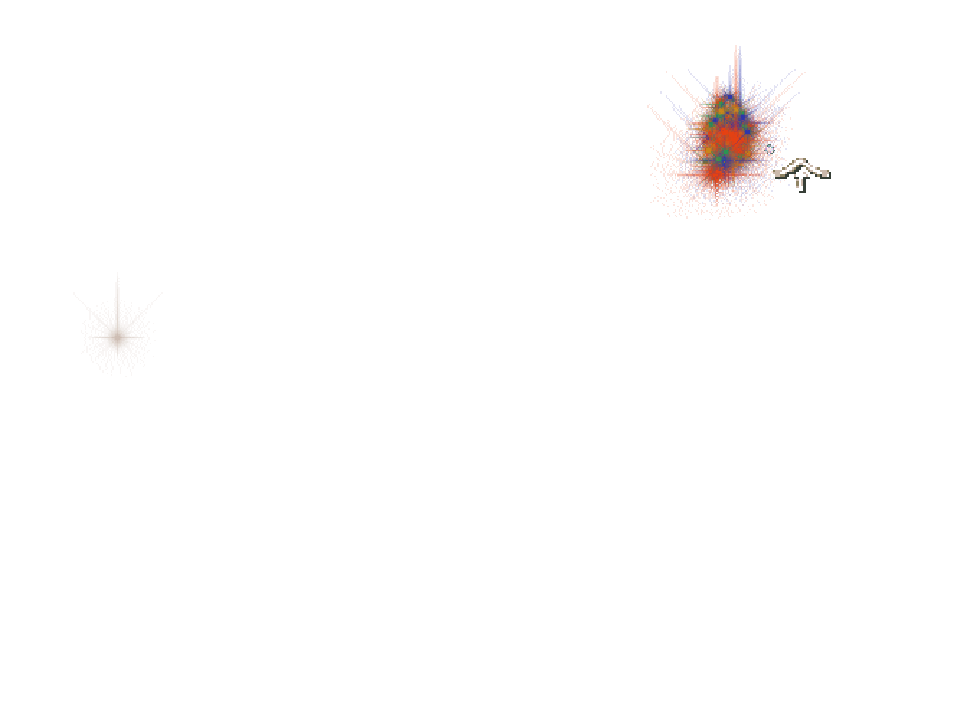

# Accepted staged old-pulse/new-body composition

Accepted at application `cfa86a32f03d021cd1ad725eed9f458ab239d56b`, checker
`66cb6b8d16631265a0b2a84e0c37a3af751530be`. This explicitly staged row creates
three gifts with declared phase/remaining overrides in two audited transactions.
Subsequent original clock visits, request drain, React HUD bridge and Canvas
rendering retain the older Lightning pulse while the new Bridge body wins.
It is not a natural simultaneous-worship claim or a literal replay of the native
ready-pair case's Tornado pulse.

All three required real frames pass: first new binding, genuine intermediate
interpolation and final leg. Their 402/862/162 command submissions retain exact
order, returned sprite identity/frame, palette, alpha and destination mapping.
The two actual keyed DOM cards bind independently to Lightning and Bridge.
Eight opaque Bridge destination texels, three ghost-318 source/returned texels
and three meaningfully tinted-1288 texels were independently decoded and checked.
Actual ghost alpha is 85/255; primitives retain exact input equality and the
existing browser-representation comparison.

The first body has an incompatible prior whose geometry and angle category both
differ. The observed rejection is therefore the combined guard, without isolating
geometry as its sole cause. Two hundred new particle slots have no prior; 160
changed matching-prior slots interpolate. Foreign old-particle slots are absent
from this late-pulse fixture, so that separate branch remains source/controller
covered without an actual browser mismatch sample.

Both complete immutable before/after fixture audits pass. Synchronous captures
and commits take 5.1/5.4 ms; the same full comparisons take 108.1/114.7 ms after
actual original body draws. The first new-binding sample is captured before its
audit flush. All three gifts pay exactly once, and 93 original object turns
reach retirement at 208 with two clean turns through 210. No observer/page errors
occur, all wrappers restore and owned browser/profile cleanup is verified.

Earlier staged1/2 remain failed and are retained separately. The accepted fix
changes observation timing only; no World, clock, rendering callback or fixture
semantics are rewritten. Sandboxed Chrome Headless Shell 154 / SwiftShader,
960 × 720 / DPR 1, CPUs 0–3. These are bounded actual submission/texel observations,
not complete independent destination raster or hardware-performance equivalence.
