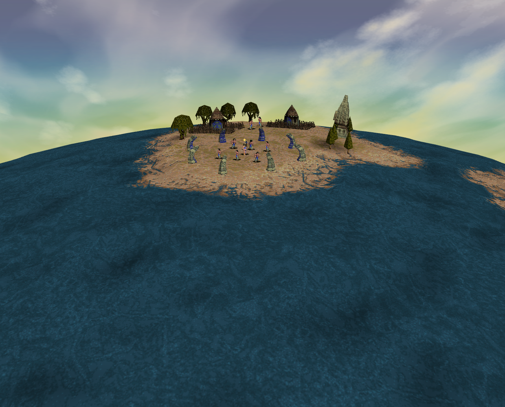
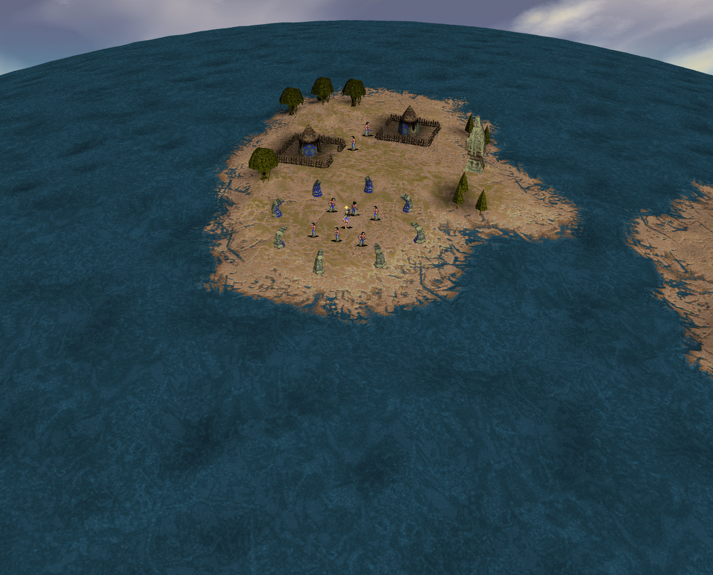
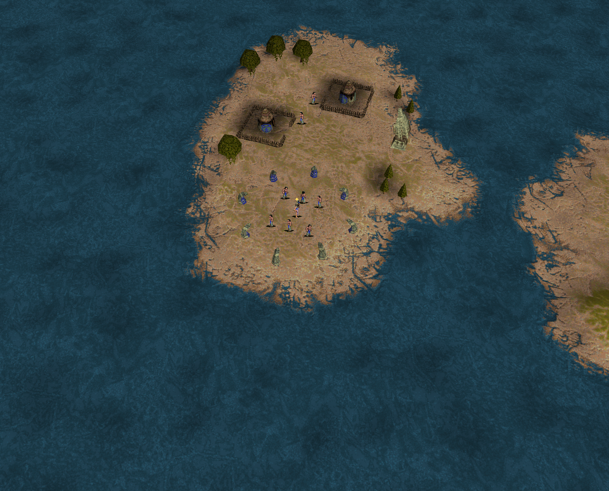

# Ordinary Mission 1 zoom: bounded evidence

One attempt **passed** on tested source
`1086322e4444f6cc3fd8b043063df63cf689699e`, based on main
`eac737a0f7411f432ed790202cde63a42e314115`. Independent final review accepted the
delivered input chronology and inspected all 12 original PNGs. No renderer or
gameplay change is made by this work, and no new renderer defect is established.

The ordinary Mission 1 opening used public startup/Skip controls and actual
keyboard input. Simulation remained at speed 1 and unpaused. The observer recorded
36 natural render returns and 14 delivered keyboard events: 50 rows and 12 PNGs
over 5.4135 seconds. The outer run finished in 48.936 seconds. These durations are
not performance measurements. All 36 sampled CPU/GPU bounds-row comparisons agreed.

- Normal → bird completed with early, middle, late and endpoint samples.
- Reversal keydown 24 arrived on turn 158 with eight native steps remaining and
  preview fraction `0.9862720000000486`, matching natural-render ordinal 23.
  The handler preserved the displayed config; render 25 followed and endpoint 32
  completed. The outgoing image is ordinal 19, not the immediately preceding frame.
- Combined sample 41 retained `w` and `q` with changed position and bearing.
  Release events 46/48 preceded endpoint 50.

Observer/page errors and captured-API cleanup conflicts were empty; the owned
observer closed and the harness finalized its browser/server. Runtime pins were
bound at launch. This ephemeral receipt has no persistent-profile cleanup or
after-runtime equality flags.
Seven console warnings remain recorded: software fallback deprecation, readback
stalls and two texture-update-without-image warnings.

## Three unchanged samples

All three images are byte-for-byte copies of natural 1240×1000 battlefield
renders from the same tested source above, at 1440×1000 CSS viewport/DPR 1.
Chrome Headless Shell 154.0.8037.92 ran sandboxed with ANGLE Vulkan SwiftShader.
These show one transition, not a before/after comparison of a renderer repair.

**Before:** ordinal 1, render 108, turn 124; normal preset 0.

**Middle:** ordinal 8, render 113, turn 131; ten steps remaining,
preview fraction `0.3878720000000736`, temporary diameter 50.

**Endpoint:** ordinal 12, render 117, turn 136; bird preset 2, diameter 75.

## Verification and limits

The nine new contracts, scoped formatting/lint, syntax and diff checks passed.
Fresh structural and context checks passed at the tested source. Historical
product coverage of 1,540 tests remains a separate carry; no fresh 1,549-test
aggregate or build is claimed. [Curated facts](facts.json) bind all 12 image
metadata records and hashes, the three published byte copies, and local receipt
hashes. Raw reports, profiles and archives remain local.

This is sampled current-port evidence. Readback perturbs scheduling. Original
raster/scheduler equivalence, every transition frame, ordinary pointer picking,
resize/seam/flyby cases and physical-display/hardware performance remain outside
this run. Issues #40, #87 and #15 are not closed by it.

Final review artifact SHA256:
`c3bad4e9df6d9e3efb5dc77a200730e1b1484b399e4298ee3be573b6613ff8b9`.
