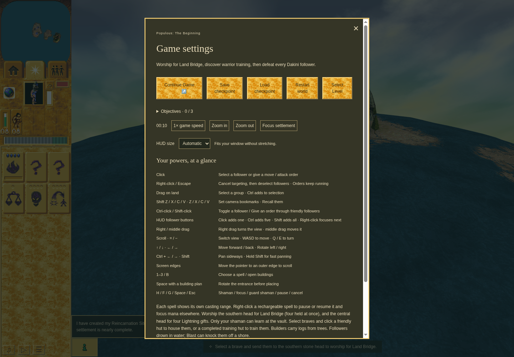
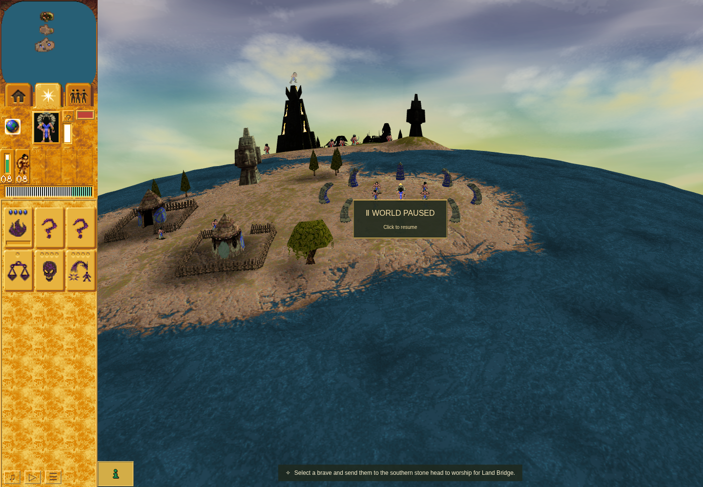

# Ordinary checkpoint continuity across browser restarts

Final source: [76257087cf746b1083e114b236f18bd64d292add](https://github.com/JohnDeved/populous-new-dawn/commit/76257087cf746b1083e114b236f18bd64d292add), merged in [PR #205](https://github.com/JohnDeved/populous-new-dawn/pull/205) as b3818511da0b420129b03092f397ad76bc6111a8.

Genuine rendered and aggregate-tested source: **fb12687d2bbad9bd817f12d8cda63209626a8f11**. [Final independent review and explicit evidence correspondence](review/REVIEW-7625708.md) accepts the later two-site, error-path-only outcome-assignment repair. The screenshots and original receipts retain their actual fb12687 identity.

## Real UI result

Mission 1 started through shipped controls and passed Shaman readiness. Game settings → Save checkpoint committed turn **121**, time **10.083333333333334**. The first harness invocation closed its owned context/browser, wrote a terminal receipt, and released its exclusive lease.

A separate invocation launched a fresh browser with that recognized task-owned profile and the same origin/source. Shipped **Load Game** restored matching level, turn/time, actor identity/position/HP, terrain and stock at the synchronous replacement boundary. The **entire committed checkpoint digest also matched**:

2f0cccb69a1b02201ce15c03d59d991ab441ca683beccc92f21e0ed0b9884174

Load then resumed the normal clock (observed turn 137); the ordinary Pause button produced the second screenshot. Both runs passed, with no browser errors and verified terminal cleanup/lease release.

Only ordinary mouse/keyboard actions and the real RAF clock changed the game. Store/IndexedDB access observed committed data and copied the Load boundary; it did not seed/export/import storage, change model state, inject outcomes or step ticks.

### Saved through Game settings

### Loaded in a fresh browser, then paused normally

Official Chrome Headless Shell 154.0.8037.92, sandbox enabled, 1440 × 1000. Browser binary/runtime hashes are in the receipts. Software WebGL fallback/readPixels/texture warnings are retained; the renderer string was not sampled. These are functional storage-continuity captures, with no hardware-performance, native-pixel-parity or campaign-completion claim.

## Verification

- [Save receipt](browser/save/receipt.json), [Load receipt](browser/load/receipt.json), and [independent restart review](review/independent-restart-review.json): genuine two-invocation proof at fb12687.
- [Full check](receipts/fb12687/full-check.json): 1,038 tests, typecheck, parity and orchestration checks passed at fb12687.
- [Final focused tests](receipts/7625708/focused.json): 19 passed at 7625708.
- [Final fault cases](receipts/7625708/fault-cases.json): 13 exact-production, runtime-faked scenarios passed at 7625708, including close/source/initial-checkpoint failures and no unsafe lease release.
- [Final scoped ESLint](receipts/7625708/scoped-eslint.json): failed only the unchanged baseline readiness empty catch. Lint is not claimed clean. The earlier three-diagnostic result and final attribution remain available.
- [Build correspondence](build-correspondence.json): all 13 production input objects and root/installed locks match the retained passed build at 6b6eb684f4f010420a758cfe4fd481b6dfca9545, with original raw streams retained. No new build invocation is claimed.
- [Final review](review/REVIEW-7625708.md), [source preflight](review/REVIEW-d9f518e.md), reproduced failure-first probes, and [two-site correspondence patch](error-path-only.patch) are retained.
- [Manifest](manifest.json) records exact source fingerprints and SHA-256/size of every bounded evidence file.

The opt-in profile storage is deliberately excluded from this branch. It remains closed and bound to fb12687 locally; the final harness requires a new profile for its changed runtime hash. Persistence covers normal termination on the same machine and does not guarantee survival of a cloud reset.

The implementation keeps default ephemeral runs, rejects unknown/personal/symlink profiles and altered game/runtime/origin inputs, and retains unknown/live/stale ownership locks without recovery. This archive establishes only the bounded harness outcome from issue #204; it does not complete the Mission 3 gameplay journey or broader save/profile release gates.
