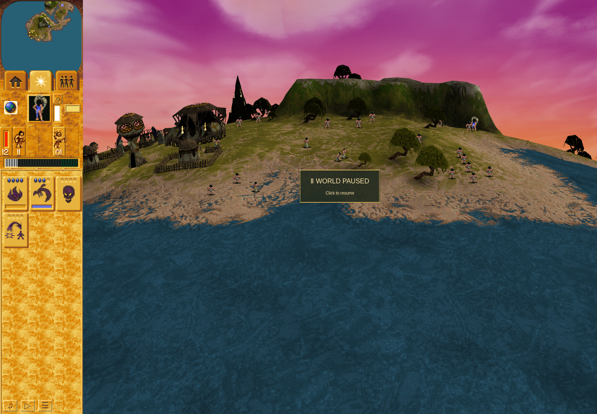

# Ordinary automatic Preacher response: baseline omission

Independently accepted ordinary Mission3 baseline evidence from tested QA
`e40eee375ac4ce862c73ef466723d1cf0d5d8883` and application
`1c7e6b05687aca14d9350e17c7ae14dc6c68bb97`. The browser run is
`b1433e27-14a0-4fb0-8611-c65a535a8a0f`, 2026-10-06 23:12:30–23:15:13 UTC.

At the prospectively retained world-turn4699→4700 visit, the ordinary-acquired
Blue Preacher3162 remains on real movement3, with queued record32 unchanged,
55HP/native life1100, and a destination still2909 native units away. Coherent
moving enemy Brave3067 remains in adjacent cell125/43 while the source stays in
126/43. The due scan has a generic miss, no primary candidate and available order
capacity. Immediate32 is absent. See [the exact pair](qualifying-pair.json) and
[independent review](review.md).

The diagnostic status is `baseline-omission-observed`; the positive automatic32
assertion intentionally remains **FAILED / exit1**. This is ordinary reachability
and source-bound caller-admission evidence. No internal scanner AL, new original
executable run, candidate32, listener lifecycle, natural release or native pixel
parity is claimed. Earlier failed attempts remain failed.

The genuine turn3336 checkpoint and original acquisition provenance are preserved.
The ordinary Shaman removed the forward defender before one Preacher move. No Save
was issued. Source/runtime/QA identity, browser/profile cleanup and continuation
checks passed, with no browser errors. [Cleanup details](cleanup.json) keep the
observer-restoration control-flow limitation explicit; no missing raw return is
invented. The baseline profile's browser data is not included.

This is the actual later paused4713 village/shore scene. The Preacher has entered
combat ownership by this frame; it does not depict the exact4700 predicate instant
or prove command32 pixels. Official Linux Headless Shell154.0.8037.92 ran through
the sandboxed maintained harness, which classifies this as software-performance-only;
no renderer-vendor or hardware-performance comparison is asserted.

[Archive](ordinary-preacher-crossing03.tar.gz), [archive digest](archive.json) and
[member manifest](manifest.json) retain the exact raw receipts, command streams,
1042 phase rows, ordinary input records, checkpoint observations and screenshots.
All20 archive members were read back and verified against their original SHA256.
Profiles, credentials, dependencies, caches, game binaries and loadable checkpoint
storage are excluded. The published diagnostic data cannot reconstruct storage.

Candidate validation is pending the reviewed combined PR247 and issue248 runtime.
No combined candidate head exists at publication; the QA candidate gate remains
disabled. Ordinary candidate production, queue/initiator ownership, listener
lifecycle, Save/Load and release/interruption remain separate requirements.
