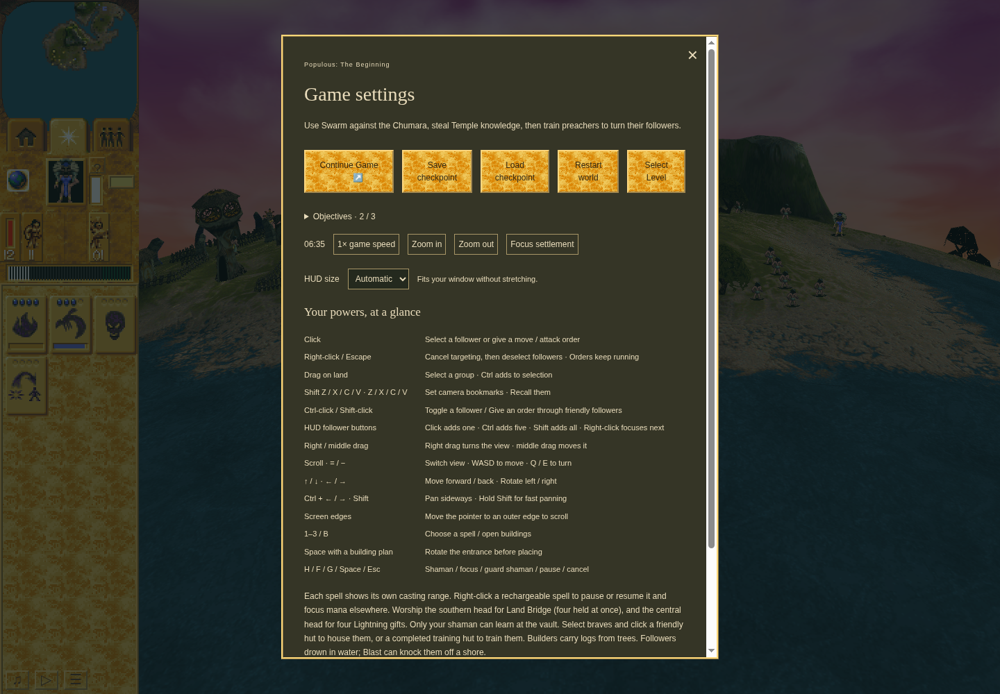
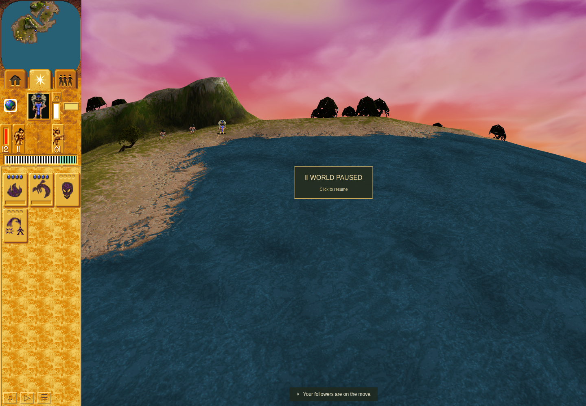

# Automatic Preacher response: ordinary Mission3 acceptance

The candidate now has independently reviewed ordinary acquisition, automatic sermon 32,
preserved movement 3, natural release, genuine Save/Load, and movement cancellation.
The evidence is composed from a reviewed callback run and a passing saved-checkpoint
tail. Every earlier failed run keeps its original classification.

Source: [runtime e4e84e22](https://github.com/JohnDeved/populous-new-dawn/commit/e4e84e225a451eb301b5e41ab27811a6c6d37300),
[callback checker 88920b26](https://github.com/JohnDeved/populous-new-dawn/commit/88920b26e1862383036e40814198d36326d9f7a1),
[saved tail dbcdae39](https://github.com/JohnDeved/populous-new-dawn/commit/dbcdae39399ba3c4f0787ce0c0d378d4f90169bd).
See [issue 243](https://github.com/JohnDeved/populous-new-dawn/issues/243),
[QA PR 246](https://github.com/JohnDeved/populous-new-dawn/pull/246), and the
[compact independent review attestations and image hashes](review-summary.json).

## Observed behavior

The original ordinary Mission3 prefix selected the mission, earned Temple knowledge,
built the Temple and trained Preacher 3162. Continuations used its real saved game.
No world mutation, clock stepping, outcome injection or storage reconstruction was used.
The [published baseline](https://github.com/JohnDeved/populous-new-dawn/blob/c6c427addcd80d586ed7dce75cc5cf4cb2c15ef1/references/verification/preacher-automatic-response-2026-10-06/baseline-crossing03/README.md)
retained a qualifying moving encounter without immediate32 and remains FAILED/exit1.

| Candidate boundary | Observation |
| --- | --- |
| Turn 4722 | The actual production scanner commit and following turn-end observation retained eligible Brave 3067 in the same native cell. Preacher 3162 received immediate record 40/model 32/flags32/reference 1 at its raw position. Original queued record 32/model 3/identity 2/reference 1 remained intact. |
| Turn 4723 | Startup was observed at substate2. The attachment had substate0; no persistent intermediate5 is claimed. Listener 3067 and actual main-render rows were retained. |
| Turn 4743 | Ordinary Pause/Save committed active 32 and the original queue. The exact saved replacement, actor, listeners and both RNGs were verified on ordinary Load. |
| Turns 4828→4829 | With no listeners,32 remained at odd native counter 219/timer 97, then released to reference 0 and restored the original movement 3 on the next visit. |
| Original run4806 | Ordinary movement input synchronously released the exact prepared 32, cleared listeners and installed movement 3. A later actor/controller handoff at 4812 failed the continuing observer. This run remains FAILED/exit1. |
| Saved tail4807 | A new ordinary Load of the same4743 checkpoint repeated the exact cancellation. All 59 pre-input observations and 48 prepared 32 logical rows passed. Later actor/controller changes were retained separately. The tail reached the paused image and ended PASSED/exit0 at 09:30:14.163 UTC. |

The callback observer forwarded the exact application-assigned flags3 value first.
Actual parsed module bodies and served stack locations bound the observation to
`combatScan` before response allocation. Whole-turn 4721 had no eligible Brave;
it was not relabeled. The new callback(T)→afterTurn(T) interval supplied the precise
consumed-input witness. The original native scanner return/AL was not observed.

## Genuine screenshots

[Paused Save UI at 4743](active32-save-4743.png): the actual active 32 checkpoint scene,
with the game-settings overlay. It is later than the4722 callback.

[Paused scene at 4857 after cancellation](post-interruption-paused-4857.png): the actual
later shoreline scene. Normal gameplay had already changed the Preacher’s controller ownership;
this image does not claim that movement 3 or its earlier native slot persisted.

## Validation and limits

The unchanged runtime passed 1,442 tests, TypeScript/parity/orchestration and build.
The final tail carries 40 focused QA contracts plus import, syntax and whitespace
checks. Its scoped lint has no new findings; the inherited cleanup `no-unsafe-finally`
diagnostic remains documented. Execution used CPU 5–7 and software rendering for
behavior evidence, not a matched hardware-performance comparison.

The original callback watch passed its mandatory pre-Save restoration assertion,
but its detailed result was later overwritten in that failed run's report. That
missing detail is not reconstructed; subsequent reporting is epoch-specific.
The tail preserved the exact4743 checkpoint, restored input/phase observers and
completed the maintained harness's owned browser/server/profile cleanup. There is
no separate post-exit OS process ledger from that harness.

[Supplied native component evidence](https://github.com/JohnDeved/populous-new-dawn/commit/d0f1092f1b4e0711ffdc848381e18e465a01c8ca),
ordinary browser reachability and these actual screenshots remain distinct claims.
This packet proves neither a complete original-game campaign nor native raster
identity. It publishes no raw archive, profile, IndexedDB payload or game-state dump.
