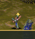
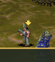

# Ordinary Preacher gesture proof

Attempt02 passed in original session 48782, 2026-10-06
15:54:14.344–16:02:10.745 UTC, exit 0. Independent result review accepted the
bounded proof on QA `0ef63ba8e1dbf2ef51e33626948e179116c40ca4`, application
`b2b04cf4915dafc7165e961f9b45ddb3efd4d103`.

The [final independent ACCEPT](attempt02/reviews/preacher-candidate-result-review-0ef63ba8.md)
and [review manifest](attempt02/review-manifest.json) supplement the unchanged
raw package's historical review-pending label.

The ordinary Mission 3 route unlocked the Temple at the Vault, returned the Shaman
home, constructed a Temple with five Braves and admitted a real trainee at
turn 2856. It reached a fresh command17 entry at 3326, then retained 858 logical
visits through timer 840 at 4173 and restart 4183. Natural source 176 completed 9
births/9 returns; source 184 completed 14/14. The original loop took 92.039 seconds,
including the ordinary pauses and active Save. No seed, phase or actor was injected.

[evidence-index.json](attempt02/evidence-index.json) identifies exact original
stream rows, owner identity, phase and both RNG words. The full stream and other
raw records are in the [byte-verified archive](attempt02/raw-evidence.tar.gz), with
all 30 members hashed by the [unchanged owner manifest](attempt02/manifest.json).
Selected readable records and PNG/RGBA files retain the archive's original paths.

## Actual pixels

Before: the accepted ordinary source 168 baseline uses QA
`9a54c932e5aaae1f50298e8e82e871ea87dfd2a8`, application
`169b5f38e8cc9f7aacbae222ba804ac519ec1f27`.
[Baseline screenshot](baseline/browser-attempt-01/source168-visible-preacher.png):
ordinary source 168 baseline, **later screenshot**; pixel readback was
turn 4281/VFRA 768. This is an independently accepted baseline, not a synchronized
before/after framebuffer pair. Its [review](baseline/review-manifest.json) and
[raw archive](baseline/raw-evidence.tar.gz) retain that limitation.

Both images use the same application b2b04cf4 and an ordinary trusted Pause. Each
PNG retains the exact turn/source/frame of the corresponding real framebuffer
readback. Body-only visibility subtraction was restored in finally. The loaded
material atlas is 2048×8192 and actual texture support is 8192. This is SwiftShader
WebGL2 evidence, not a hardware-GPU claim.

Source 176 at turn 3412: frame 4, VFRA 807, 223 changed RGB pixels.
[Full screenshot](attempt02/work/orchestration/preacher-gesture-candidate/browser-attempt-02/source176-turn3412-full.png).

Source 184 at turn 3505: frame 1, VFRA 870, 216 changed RGB pixels.
[Full screenshot](attempt02/work/orchestration/preacher-gesture-candidate/browser-attempt-02/source184-turn3505-full.png).

## Save/Load and supersession

The active source 176 Save committed at turn 3412. A fresh page's actual Load
replacement matched that exact phase and both RNGs. The first later bound sample
is 3495, and resumed 3499 is another later observation; intervening updates are not
reconstructed or described as an immediate next-frame comparison.

In the loaded epoch, normal ground input superseded the same owned actor while
source 184/frame 3 was active. The actual before/after input boundary is turn 3603;
movement/source 40 was observed at 3608. No stale sermon owner continued animating.
Observer callbacks and hidden layers were restored, original process exit was0,
and source/runtime identities remained unchanged. Port4404 was checked by a later
exclusive bind; that is not an exit-time process observation.

## Preserved failed attempt

Attempt01, QA `732652b27399dbfe799c1e89353fc895bc3f2b93` on the same applicationb2,
failed before the Shaman home-return pointer dispatch with
`Ground pixel changed before delivery`. It did not reach gesture or checkpoint
proof. Its [manifest](attempt01/manifest.json), [receipt](attempt01/browser-attempt-01/receipt.json)
and [raw archive](attempt01/raw-evidence.tar.gz) are preserved. No particular
occluder or missing neighbour is inferred from the failed capture. Attempt02's
fresh ground check succeeded at its original center; it needed no alternate center.

The ordinary proof covers this finite gesture/checkpoint/supersession scenario.
It does not prove conversion, combat, victory, a full campaign replay, audible
output, native sound-mixer RNG, or the four residual native state/return rows.
