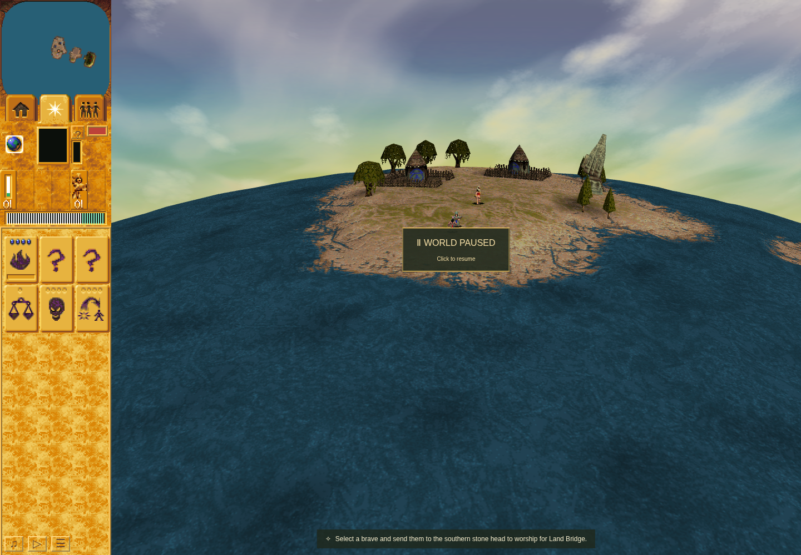
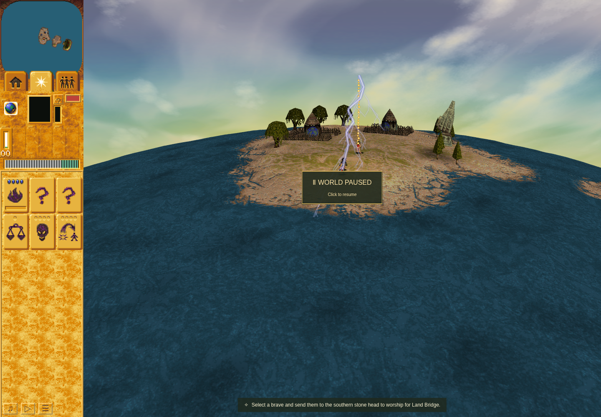
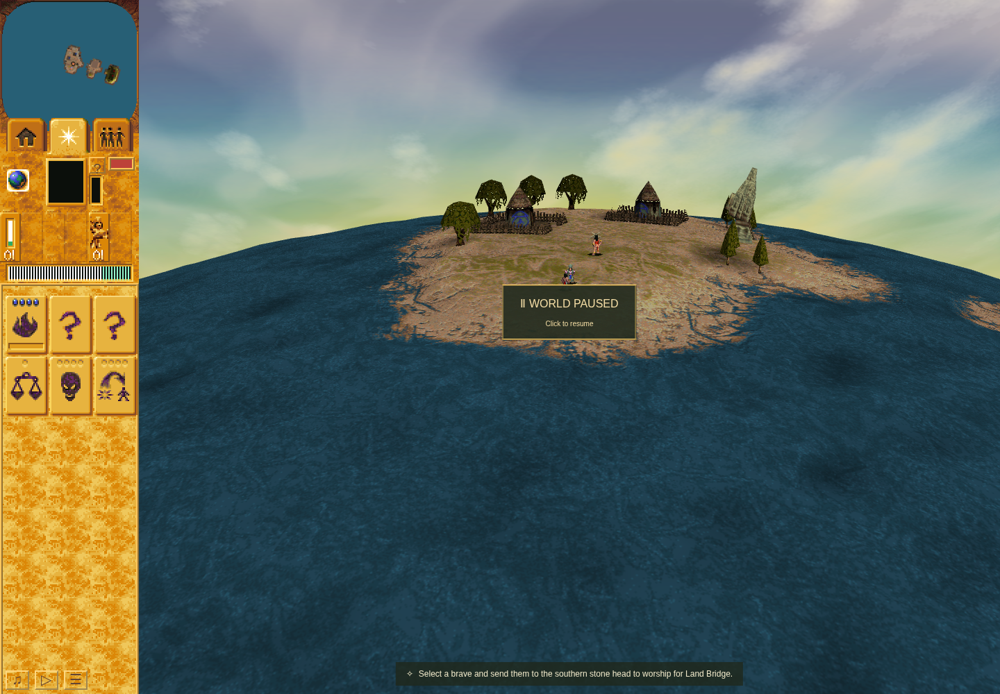

# Active Preacher retaliation verification

Issue [#206](https://github.com/JohnDeved/populous-new-dawn/issues/206),
PR [#207](https://github.com/JohnDeved/populous-new-dawn/pull/207).

The live computer-spell adapter now preserves the current person's assignment bit.
An actively preaching enemy can therefore trigger the already native-backed Blast,
Swarm or Lightning response. The only production change is that one adapter field.
Flags2, disguise, target ordering, spell controller, mana and readiness are unchanged.
The native probe also gains an explicit owned failure-output path; its comparisons
and fixtures are unchanged.

- Base application: `dcfb0dc2afe3e2501f964b109933e43d8bdbd451`
- Tested candidate: `3df229bf4ab76cb8d08722cef728829c60fc0023`
- [Source/native correspondence](../../../decomp/research/preacher-spell-retaliation.md)
- [Exact inventory](manifest.json) and [original raw evidence](raw-evidence.tar.gz)

## Results

| Check | Result and boundary |
| --- | --- |
| Failure-first live regression | Base: 11 pass, 3 expected missing-cast failures. Identical 14 cases pass after the repair. |
| Native emergency/general controller | Passed all 1,040 comparisons: 17 Blast, 4 Lightning, 1 Swarm, including 4 Preacher responses. Original final allocator remains the supplied boundary. |
| `npm run check` | Passed: 1,064 tests, TypeScript, parity metadata and orchestration structure. Existing natural-M3 preaching/cancellation/checkpoint assertions were unchanged. |
| `npm run build` | Passed. No deployment. |
| Rendered candidate | Passed all five cases: three positive spells through actual fixed-turn tribe dispatch, ordinary movement-command cancellation, and invisibility. No browser errors. |
| Exact-base rendered comparison | Passed: same producer, checker, canvas/renderer and capture turn 10; base has zero casts and candidate has one Blast. |
| Focused TypeScript formatting / ESLint | Passed on changed source; checker syntax and ESLint also passed. |
| Full formatting | Failed on two inherited, byte-identical base files: `app/render-view.ts`, `app/viewport-bounds.ts`. |
| Full ESLint | Failed: 285 errors / 2 warnings across 46 files, all byte-identical to base. No unrelated cleanup. |
| Full Oxlint | Failed with inherited findings. Changed-file base/candidate comparison retains the same 73 diagnostics: 16 errors / 57 warnings. |
| Fallow | Health and duplication runs completed exit 0 with advisory findings; unused run exit 1 findings. No tool failure or opportunistic deletion. |

Raw receipts retain commands, exact source state, statuses, raw stdout/stderr and
hashes. Earlier failed assertion/diagnostic attempts are preserved, including the
initial test's mistaken cell-corner expectation, corrected before its final
failure-first run. No failed gate is represented as passing.

## Before and after

Both screenshots use a 1440×1000 page, 1240×1000 game canvas, Chrome Headless Shell
154.0.8037.92 and ANGLE/SwiftShader, at diagnostic turn 10. They are actual captures,
with the ordinary pause overlay visible. The before server runs the untouched dcfb
application in its own detached checkout; its sole added file is the byte-identical
candidate checker. `before-after-correspondence.json` in the archive binds its
served root, source, checker hash, capture turn, producer and screenshots.

| Before: dcfb0dc | After: 3df229bf |
| --- | --- |
|  |  |

The candidate's actual fixed-turn spell allocations target `(11,33)` from the Red
Shaman. Subsequent real effect groups contribute 281 Blast pixels, 1,258 Swarm pixels
and 10,141 Lightning pixels in the isolated GPU visibility check. Those counts prove
visible contributions in this scene; they are not performance measurements.

| Swarm fallback, candidate turn 10 | Lightning fallback, candidate turn 11 |
| --- | --- |
|  |  |

| Movement cancellation | Invisible Preacher |
| --- | --- |
|  |  |

The cancellation control changes assignment 336→280, releases the state-23 listener
to state 10 with owner 0, retains the actual movement order, then allocates no spell
on the next AI turn. The invisible control also allocates no spell.

## Reproduction and limits

```sh
node --test tests/preacher-spell-retaliation.test.mjs
python scripts/check-native-emergency-spells.py "$POPULOUS_EXE" \
  --failure-output work/orchestration/preacher-retaliation/native-mismatch.json
node scripts/check-browser-preacher-retaliation.mjs --port 4367 \
  --browser "$POPULOUS_HEADLESS_SHELL" --output work/orchestration/preacher-retaliation/candidate
# From an actual dcfb application checkout containing the identical checker:
PND_PREACHER_CAPTURE_TURN=10 node scripts/check-browser-preacher-retaliation.mjs \
  --scenario before --port 4367 --browser "$POPULOUS_HEADLESS_SHELL" \
  --output work/orchestration/preacher-retaliation/before
```

Actors and spell prerequisites are staged. The sermon bit and listener are produced
by six real fixed turns; each positive browser case then uses the real
`tick → processTribes → withCampaignTribe → stepComputerSpells` caller. This is bounded
rendered integration, not natural acquisition, ordinary-control campaign acceptance,
a new uninterrupted native producer-to-controller run, or hardware performance.
Software-renderer/readPixels and an initial texture warning are retained in receipts.

The bug suppressed retaliation. It cannot explain the earlier M3 Preacher deaths.
The separate M3 ordinary-control work keeps its pinned b381851 application and profile.
No parity credit, broader #4/#11 closure, new assets, shared fixtures or performance
claim is included.

Both browser runs closed; port 4367 was verified free. The single real dependency
tree was moved serially with matching root/installed locks and fresh receipts at both
ends, then returned to the feature worktree. No dependency copy/install, native
binary, profile, environment file or credential is in this evidence packet.

The archive contains 98 original text artifacts and was verified against every
member hash. Its SHA-256 is
`4f61806a1fd667cba6da7887f61695aa6ab9f32e88d0b1eb7686f902ac51564a`.
