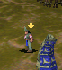

# Preacher terminal restart: accepted bounded result

Application bd07a6302bb0170e9d6dc235983c2a961694d753, [PR #241](https://github.com/JohnDeved/populous-new-dawn/pull/241).
Exact code, focused/native replay evidence, standard/scoped quality gates and one ordinary passive result have independent ACCEPT. The coordinator owns final integration. This evidence publication does not change the application branch.

[Implementation, full check/build and quality proof](README.md) retains the four initial regression failures, six passing focused tests, strict 27-case/63-visit replay, all 1,349 full-suite tests and production build. [Ordinary result review](ordinary-e49e4473/reviews/preacher-cutoff-result-review-e49e4473.md) accepts the single run below; [review manifest](ordinary-e49e4473/review-manifest.json) binds its original [raw manifest](ordinary-e49e4473/manifest.json) and [29-member raw archive](ordinary-e49e4473/raw-evidence.tar.gz).

## Ordinary model behavior reached

QA e49e4473adc256450874cbbe48ff9c97bbc4fbd0 used the exact candidate application and unchanged acquisition/input path. Brave 309 entered Temple 1021 at turn 2838 and became Preacher 3160. The fresh command17 owner retained its actor, native owner, world and sole order through 858 controller/updater visits and the full 840-turn loop.

The observed sequence is:

- Turn 4139: terminal timer840/substate4 with the entry bit set
- Turn 4140: actual phase4 stop selects source48/draw16; f2 remains4, then the normal updater advances it to5
- Turn 4141: entry selects source160/draw19, resets1/0 and updates0/0
- Turn 4149: fresh loop selects source168/draw14

Observation finished in 71.474 seconds within the 900-visit/120-second bound. Session49110 exited0; source/runtime/lock identities, callback restoration and terminal cleanup passed. No extra run, fresh baseline, Save/Load stage or supersession stage was added.

## What was actually rendered

The main renderer skipped turn4140. There is no source48/draw16 framebuffer or image witness, and no visible-improvement claim. The two actual retained crops surround that missing interval:

Source168/draw14 at turn4138, f1=0/f2=3:

Source160/draw19 at turn4141, f1=0/f2=0:

These are 69×78 framebuffer crops, not screenshots or reconstructed poses. The PNGs are lossless encodings of the raw RGBA, with row order reversed for viewing; the independent reviewer verified both encodings. Readback took 89 and 88.5 milliseconds and may affect presentation cadence. The skipped middle render describes this instrumented run, not an inevitable display outcome.

The natural initial839/middle840 frame values differ from the supplied native case. Both descriptive native animation-subset flags remain false. Ordinary RNG values are whole-world callback snapshots, not isolated controller inputs. The accepted isolated native proof and this ordinary reachability/state result remain separate claims.

Shared command32 expiry/release and positive-listener turning/RNG residuals, complete Tower/vehicle consumers, whole-controller/native-world parity and the broader animation report in #214 remain open. Global clock and render cadence code are unchanged. Historical raw packages, including their pre-review status text and earlier false-pass regression, remain byte-for-byte intact.
