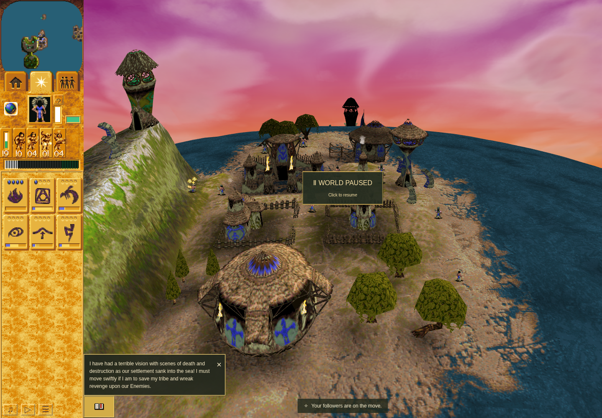
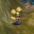

# Reviewed four-fix integration: evidence and gallery

The accepted application source is published at [169b5f38](https://github.com/JohnDeved/populous-new-dawn/commit/169b5f38e8cc9f7aacbae222ba804ac519ec1f27) on `integrate/reviewed-parity-four-20261006`. Capture-only QA is published separately at [15a05705](https://github.com/JohnDeved/populous-new-dawn/commit/15a057056d88282686d2eb7e84dae1c843f6edb8); its application, public assets, scripts, tests and package inputs match the application delivery. This evidence branch is separate from both and is not intended for merging into main. Main was verified at `89e68606a406f93715b930550317519818ddc081` before this publication; no main merge or deployment is performed here.

The source combines four bounded corrections: Mission3 rejects disabled/capped/full-pool raids before target-selection RNG; recruitment uses the explicit construction base or authored loaded Shaman origin; original Firewarrior source720 resting artwork is appended without replacing existing sprites; firing restores source56/draw13, phase entry/timers and paired-launch/recovery behavior while retaining an atlas that fits an8192 texture limit. Refs #214, #227, #228, #229. This does not close broad animation issue214 or establish whole-game parity.

## Validation and acceptance

- On application `169b5f38`: typecheck,1329/1329 tests, parity/orchestration, production build, scoped Oxfmt and ESLint passed.
- Scoped Oxlint remains **failed** with44 errors/94 warnings versus base44/95. Full diagnostic and source-span attribution found zero introduced diagnostics and one already-reviewed removed warning. Fallow results remain advisory; no clean repository-wide quality claim is made.
- Fresh ordinary Mission10 browser execution was on QA `15a05705`, not relabeled as a source-commit execution. Brave122 naturally trained into Firewarrior181, moved through public controls and automatically attacked Tower65 with projectiles195/196. Paused capture is turn608; actual adjacent-turn observations show phase40 at612 and command release613.
- Actual2048×8128 atlas allocation/upload and map binding were observed on an8192-limit context. Both PNGs were independently inspected and the crop matches the exact full-image pixels. The sandboxed Headless Shell154.0.8037.92 run uses software WebGL/SwiftShader; retained warnings and renderer limits remain.
- Source and explicit input fingerprints stayed unchanged. The terminal harness completed and same-invocation cleanup verified loopback4411 released. Final [source review](reviews/combined-parity-source-review-169b5f38.md) and [browser result review](reviews/combined-parity-browser-result-review-15a05705.md) both ACCEPT the bounded integration.

## Genuine screenshots

Mission10 at exact QA `15a057056d88282686d2eb7e84dae1c843f6edb8`, with application/public trees identical to source `169b5f38e8cc9f7aacbae222ba804ac519ec1f27`. Ordinary acquisition and automatic building-target firing; paused source56/draw13 at turn608. These are actual1440×1000 software-rendered pixels, not original-game screenshots or hardware-performance proof.

Exact70×71 crop at(426,409) from the full capture above.

## Native and scope boundaries

The native comparison is a finite **supplied-state controller experiment**. Its grounded class1/model6/state10 actors start at command21, substate10/person or11/building. Actor/target state, flat land, allocation context and pointer tables are supplied. The original asset loader is not executed; frame-count records come from the original asset chains through the reviewed reader boundary. Two allocated slots are supplied while their original initializer executes; audio/sunlight leaves are logged no-ops, and the building-target coordinate leaf is supplied. Counter1 excludes periodic retargeting. There is **no world or animation update between native visits**; cooldown and projectile presence/lifetime are fixture inputs. Native call counts are not elapsed gameplay time. See the preserved [original native boundary](reviews/original-native-preflight.md#supplied-fixture-state-and-leaves).

At native execution source `2ea28387`, the frozen owned projection matches16 cases/60 visits with zero owned differences. The full raw comparison remains **failed** with172 diagnostic differences:88 active diagnostics and84 terminal residuals. Four capped cases remain partial: person/building idle-frame4 entry and person/building cooldown entry. Facing, outer completion cleanup and residual raw fields remain outside the accepted private-body projection. Original acquisition, original Windows execution, full native-world composition, selection-radius/base eligibility, ordinary person-target firing, every animation visit, original-raster/GPU pixels and hardware performance are not established.

The raid evidence separately bounds allocation/RNG and recruitment-origin ownership, retaining supplied population/world inputs and the known shared radius/base-eligibility differences. It does not establish complete Mission3 native-world equivalence. Resting artwork's native layer/raster boundary does not certify complete original renderer pixels.

## Provenance and publication status

[manifest.json](manifest.json) indexes the public packet and exact hashes. [raw-evidence-169b-15a.tar.gz](raw-evidence-169b-15a.tar.gz) is the unchanged2,423,552-byte accepted raw archive; [evidence-inventory.json](evidence-inventory.json) indexes its81 payload files plus the inventory. All archive payload bytes and separately exposed PNG/review files were verified before commit. Game executables/data, downloaded tool/browser/dependency payloads, profiles and authentication files are excluded.

Historical receipts, reviews and `historical-local-package-manifest.json` deliberately preserve their original local-only/authentication-blocked wording and failed statuses. Those are immutable statements about their execution/packaging time; **source and QA publication have since succeeded**, and this branch publishes the combined evidence/gallery. No earlier result is rewritten as a pass or as a combined-source execution. Original separate component evidence refs remain public and separate.
