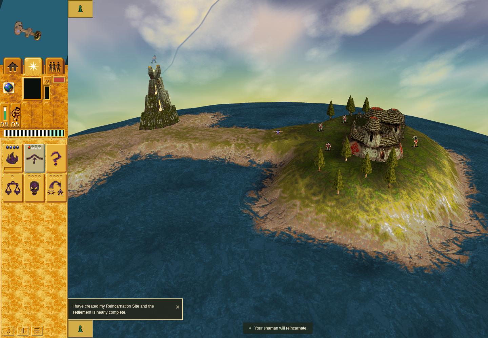

# Shaman phase 1 ground following — PR #212

This is **controlled-clock rendered integration** through ordinary UI commands.
RAF is held and normal fixed turns are supplied explicitly, bypassing
`advanceGame` presentation cadence and scene turn observers. Camera preparation
is controlled. This is not a real-clock mission journey, an original raster
comparison, or a hardware-performance result.

The shipped Mission 1 Shaman worships the authored head for four Land Bridge
gifts, makes two crossings, attacks Warrior 33, and casts another Bridge while
injured. The real terrain controller appears while she still has 20.6 HP; ordinary
combat then kills her while eight friendly Braves survive. No HP, stock, mana,
actors, terrain, death effects, AI or outcomes are injected.

Both runs use identical driver SHA256
`9629f540bee99fd923b4169885a11891293c825f95eb58ecd60fadac74e19399`.

- Before: `89c9629991489fd1ce6dc52e938d1cec346bfead`.
- Candidate: `c5a5042fa4db91ba782a889dc4c4c309462726e1`.
- Accepted base: `48112b16dafea0cee29ec4b3af8301f79cd9ef5a`, whose changes from
  the before source are reference documents/images only. Application, scripts,
  tests, packages and engineering metadata are byte-identical between those bases.

The driver uses public Select Mission 1 → Start Mission 1, H selection,
worship/move/attack clicks, spell HUD buttons and ground clicks. It verifies
immediate command acknowledgment, each stock decrement, the original living
caster and windup projectile, real Bridge creation, ordinary combat death,
nonzero death-point deformation, a stable model 12 anchor, mesh height and
framebuffer contribution. All 64 observed post-entry samples remain in phase 1.

## Comparable rendered result

At turn 1179 both runs have ground/body/stored height 171. Their initial screenshots
are byte-identical (SHA256
`b112aec7191e371abd8558ae8bd773b5fd4ebf61f1153096b1c9176b8d1f0fb0`).
UI actions, death/controller identities, world turns and simulation/cosmetic RNG
states also match. At turn 1243 the real Bridge has raised the death-point ground
to 173:

| Observation | Before | Candidate |
| --- | ---: | ---: |
| Ground samples | 171, 172, 173 | 171, 172, 173 |
| Body/stored samples | 171 | 171, 172, 173 |
| Height mismatches among 64 samples | 54 | 0 |
| Final mesh Y | 171/128 | 173/128 |
| Effect framebuffer contribution | 197 pixels | 211 pixels |

The terrain change in this route is only two native height units. Its visual
correction is subtle: 124 pixels differ, confined to the body at image coordinates
x 805–835, y 383–392. Both 1440×1000 captures below are unmodified.

Before: ground 173, cached body 171, exact source 89c9629.

Candidate: ground/body/stored 173, exact source c5a5042.

## Provenance and limits

[Validation and hashes](validation.json) bind the same driver, base correspondence,
raw result fields, gate receipts and screenshot hashes. [Before command](before-command.json)
and [before renderer receipt](before-receipt.json) record original session 42130;
[after command](after-command.json) and [after renderer receipt](after-receipt.json)
record original session 37344. Both return 0, source fingerprints remain unchanged,
and the owned server port 4371 is closed after cleanup. The runs are serial on
CPUs 0–3, with a 150-second harness deadline inside a 180-second outer bound, using
sandboxed Chrome Headless Shell 154.0.8037.92. No hardware-speed claim is made.

The carried aggregate passed 1068 tests, typecheck, parity and orchestration checks
on 5eee5db; the production build passed on 56ff9cc. Their exact production/test/package
correspondence is recorded. Later changes are documentation and this UI driver;
the final driver has a fresh syntax pass and explicit ESLint 0 errors/0 warnings.
Fourteen focused regressions and the original-byte ground/VFX/reincarnation probes
also pass on byte-identical runtime/probe inputs. Existing TypeScript ESLint 210 and
Oxlint 281 findings match the accepted base; introduced findings: 0.

The [native evidence note](../../../decomp/research/shaman-death-vfx.md#phase1-ground)
separately establishes per-visit phase 1 sampling and retained phase 2/rise height.
Its changing-terrain caller fixtures, supplied native leaves, normal combat entry,
direct unsupported entry and original raster limits remain explicit. This rendered
pair does not establish full drowning gameplay, post-elimination cleanup, the full
Shaman death composition, or complete issue #30, and adds no parity credit.

The earlier aggregate and two failed browser attempts remain retained. The browser
failures occurred at mission entry and first cast acceptance; neither is treated
as the expected cached-height witness. The successful pair uses the same repaired
driver on both sources and retains every gameplay and height assertion.
