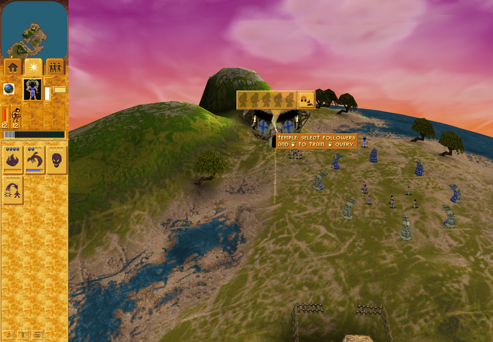
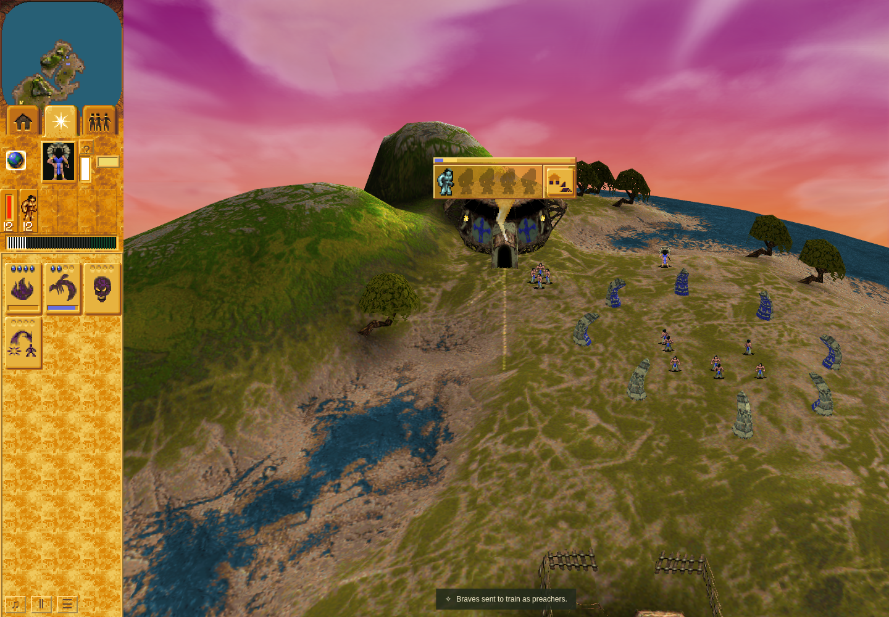
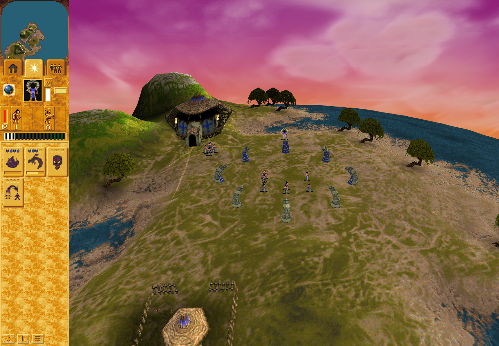

# Temple manual inspection: final ordinary witness

Ordinary attempt 04 is **PASS** on QA
`01ff23c93ea617746273757ec8b1c7f694926893`, tree
`76744af62e743717ee0d4cbea1bd8206083bc202`, with unchanged product
`8512737f0c24b56d199cb327644b9eb6ca67b156`. Independent final result review: **ACCEPT**.
Verdict SHA256: `3659850f558128e50763e01d1a0da4489a1a6b39a8cc3d647618a1f93bd886b8`. This packet supports [product PR #296](https://github.com/JohnDeved/populous-new-dawn/pull/296);
[QA PR #297](https://github.com/JohnDeved/populous-new-dawn/pull/297) retains its
maintained-driver ownership. Supporting evidence is outside the product merge
dependency. This finite slice does not complete issue #25 or full gameplay parity.

## Demonstrated ordinary path

The run continued through public Load from genuine Mission 3 Save 2695, produced
by the ordinary acquisition/construction prefix in attempt 02. It did not inject
a Node fixture or replay simulated construction. Exact source/checkpoint
correspondence and launch were separately admitted. The inner run completed
2026-10-10 01:17:32.764–01:19:03.726 UTC, exit 0.

| Boundary | Observed result |
| --- | --- |
| Idle manual activation | Imported name display created record 2 at turn 2823. |
| Repeated explicit input | Same manual record reused at turn 2839, without restarting it. |
| Hold, release and expiry | 38 off-target held visits, release at 2860, complete retirement at 2869. |
| Training approach | Trusted manual inspection created record 4 at turn 2964. |
| Real training request | At 2979, `automatic:reused` retained identity 4, phase 1 and remaining 15; only automatic/latch ownership changed, with one reservation. |
| Active Save | Public Save and committed storage matched at turn 3012. |
| Public Load | First publication matched expected production migration; old Scene disposed and the Page session retained. |
| First resumed callback | At 3013, a fresh automatic record was created in the new epoch at phase -1 / remaining 0 / hold 16. |
| Natural conversion and exit | By terminal turn 3234, original trainee 303 had retired, one living Blue Preacher 3167 existed, trained was 1, and record/latch/reservation/panel DOM were absent. |

Full typed checkpoint digests are intentionally distinguished:

- Startup Save 2695: `ed9e36de19fdca40671f2ff54d0f785f2f00417c6d87f11f8c8a3f92f902bf51`.
- Active Save / committed / terminal storage: `52f22821fe2668eacfc24d1e5754dbce925f4fb7770fb4f890ef5ed9fe30dea4`.
- Expected migrated Load / actual first Load publication: `b8777edd3f9ca81807cc03e31b095568564474c81b7558f8953e93fb44f4a744`.

The Save and Load full digests differ; Load is compared with production migration,
not incorrectly asserted equal to the saved object graph. The active Save
at turn 3012 remains unchanged at terminal readback. [The compact summary](summary.json)
retains full typed component digests, exact boundaries, source and receipt hashes.

## Preserved failures and earlier proof

- Ordinary 01 remains **FAILED**: genuine knowledge acquisition succeeded, then
  the home minimap view was rejected before construction. Its precise subcause
  was not recorded; no manual tail or Save was reached.
- Ordinary 02 remains **FAILED**: genuine construction and Save 2695 succeeded,
  then Vite treated the local `require(condition, message)` guard as a dynamic
  require and returned HTTP 500 before manual observer installation.
- Ordinary 03 remains **FAILED**: public startup Load and idle lifecycle are
  independently accepted, but the trainee entered at 2970 and a fresh automatic
  record appeared at 2971 before later manual input. Its bounded
  [report and original screenshots](../temple-manual-ordinary-03-2026-10-10/README.md)
  remain intact. It was not retrospectively promoted to a full pass.
- The ordinary-04 **launch-string guard failed before launch** because it
  compared a full accepted decision with abbreviated `ACCEPT`. No browser,
  resource, profile or output writes began in that rejected attempt. The exact
  verdict hash/full string were then checked and all unchanged immediate guards
  rerun. The rejected receipt is preserved by immutable hash in the summary.
- The separate **first Vite setup cleanup remains UNKNOWN**. Later successful
  cleanup does not erase that uncertainty.
- Strict Oxlint remains **FAILED** on 35 independently accepted inherited
  warnings and one inherited error. No clean strict-lint claim is made. The shared Mission 1 input formatting
  failure also remains inherited and explicit.

Product source/focused/current-quality review and the fresh full
[17-stage / 1,755-test / 287-file standards](../temple-manual-source-standard-2026-10-10/README.md)
remain accepted on exact product 851. That report preserves development reds,
failed green/preflight attempts and the rejected nested-summary aggregation.
No prior failure is discarded, and no test or browser run was repeated solely
for this publication. Normal final-run cleanup, both closed observer epochs,
restored Save/Load listeners and absence of owned browser markers were verified.
Later observed steps remained released through turn 3254; this does not erase the
separate first-setup cleanup uncertainty.

## Original final-run pixels

These unchanged 1440×1000 captures use Chrome Headless Shell 154.0.8037.92 and
software rendering. They follow recorded predicates; screenshot instants are
not assigned unrecorded simulation turns. This is a same-run lifecycle comparison;
camera framing changes after Load. It is not a prior-product or original-raster
pixel comparison.

Manual name and idle panel visible:

One trainee in the five-person-capacity panel, with training progress visible:

After conversion and complete panel retirement; post-Load camera framing differs:

PNG hashes and exact bytes are in the summary. Native walltime cadence, complete
Temple raster equivalence, physical allocation and hardware frame performance
remain outside this proof. No full parity claim is made. Raw archives, profiles
and traces are not published.
