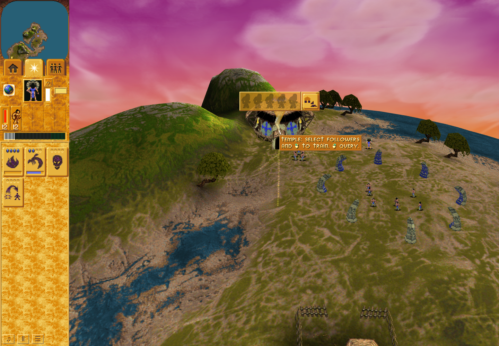
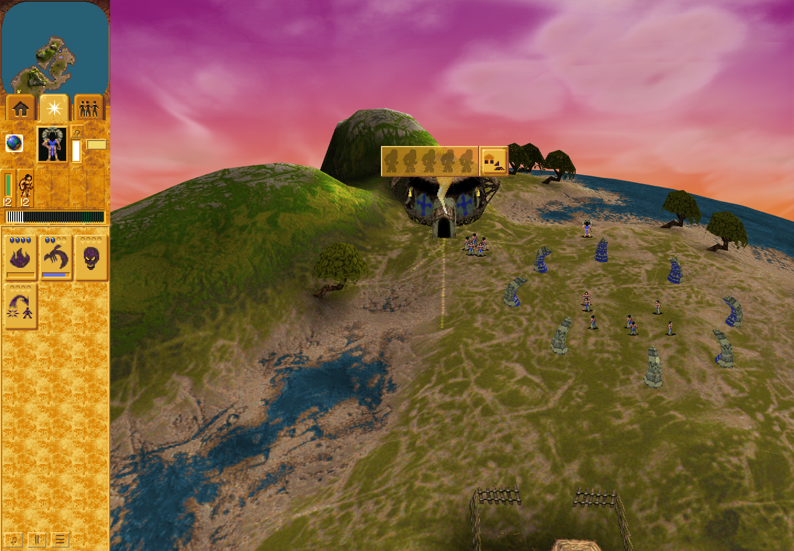
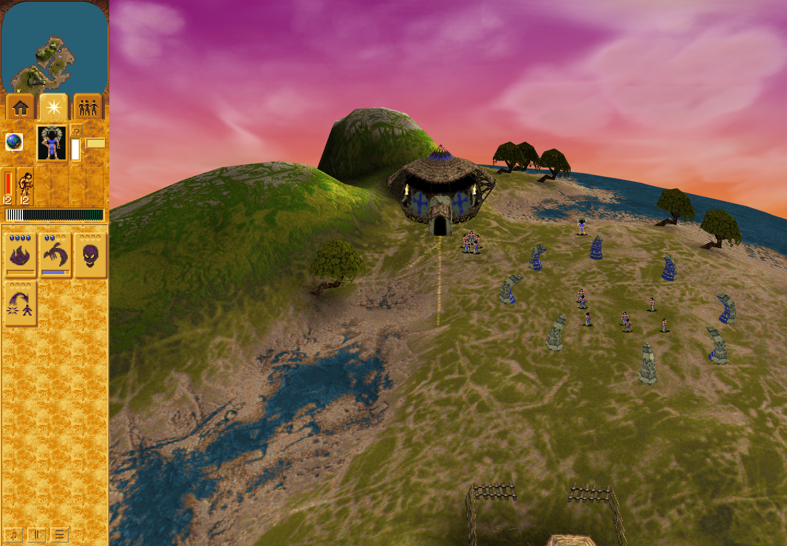

# Temple manual inspection: bounded ordinary attempt 03

Overall result: **FAILED**. Independent review **ACCEPTS only genuine public
startup Load, the complete idle manual lifecycle and normal cleanup**.
Manual-to-automatic reuse, active Save/Load, conversion and the complete ordinary
episode are not established. This supporting packet is outside product merge
dependencies. [Product PR #296](https://github.com/JohnDeved/populous-new-dawn/pull/296)
and [maintained-driver PR #297](https://github.com/JohnDeved/populous-new-dawn/pull/297)
retain their remaining acceptance gates.

## Exact source and accepted segment

Product `8512737f0c24b56d199cb327644b9eb6ca67b156` and its independently accepted
17-stage / 1,755-test / 287-file standards are unchanged. This run used QA source
`b77ef76af26dcaf91e20600d80836ab159142b6b`, tree
`cf19ea0d8c796ee9b8cc5a5e34a57d73207dc663`. The reviewer verified source, runtime,
scenario and input bindings remained stable. Inner run: 2026-10-10 01:03:05.881
through 01:04:16.975 UTC, exit 1 with no signal.

Public Load restored the genuine committed Save at turn 2695, Temple 1021,
zero trained, with its trusted synchronous first publication paused. The full
typed digest matched the expected production migrations and committed/terminal
checkpoint: `ed9e36de19fdca40671f2ff54d0f785f2f00417c6d87f11f8c8a3f92f902bf51`.
That digest also equaled the original Save in this run; this is not a general
claim that migration preserves every digest.

The accepted idle segment created manual record 2 at turn 2822 from the real
imported name 913 display, with threshold 25 reaching dwell 26. Its creating
controller visit reached phase 0 / remaining 2. Trusted explicit input reused
that same record at turn 2840 without changing its dwell. The record survived
40 off-target held controller visits; release was observed at turn 2862 and
retirement at turn 2871. Independent inspection of 218 retained rows confirmed
entry, renewal, hold, three exit visits and terminal record/latch/reservation/DOM
release. No training occurred in this idle segment.

## Failure and retained limits

During the later approach, trainee 303 entered at turn 2970. The real training
callback created fresh automatic record 4 at turn 2971 before any later manual
creation/input. The strict manual-before-automatic requirement failed, closing
the observer; later `armInput` rejected it. This does not demonstrate a product
defect or permit a relaxed/retrospective pass.

No manual pointer pair or same-record automatic reuse was observed in that
approach. Active Save, in-session Load, natural conversion and full post-training
retirement were not reached. The QA author is repairing approach timing only;
continuation requires a new exact source/admission review.

Attempts 01 and 02 remain failed: 01 acquired knowledge but rejected the home
minimap view before construction, with the precise minimap subcause unrecorded;
02 completed genuine construction and Save 2695 but hit a Vite dynamic-require
HTTP 500 before observer installation. Both prior failures remain retained.
This run's normal cleanup and saved-profile continuation checks passed. The
separate earlier Vite setup cleanup remains unknown. Strict Oxlint remains
failed on the accepted 35 inherited warnings and one inherited error.

## Inspected same-run pixels

These unchanged 1440×1000 captures use Chrome Headless Shell 154.0.8037.92 and
software browser rendering. They follow recorded predicates; no exact simulation
turn is assigned to an unrecorded host screenshot instant. They compare lifecycle
states within this run, not old-product versus new-product screenshots. They do
not establish original raster, native walltime, physical allocation or hardware
frame-performance equivalence.

First: the completed Temple, imported name and idle manual panel are visible.

Held: the manual panel remains visible while the name is hidden.

Released: the retired panel is absent.

| Original PNG | SHA256 |
| --- | --- |
| temple-manual-first.png | `2adbc1564f8890d65ee4db4a2fdbd9d8e427df81cd9d34a665d17aa1918fcc6b` |
| temple-manual-held.png | `04079b9faeb8266a163b7f8a1017bcb25d9debfd3a2000fe3bdeef26e9ee1048` |
| temple-manual-released.png | `0afe20dced4b4f3a653d6a89dc416bc3016bcdb89dae1a6d8037c31fb2d24e99` |

[The concise summary](summary.json) retains exact source, receipt/PNG hashes,
accepted facts, failed attempts and limits. Independent bounded-result review
SHA256: `bd5063f2a1e0f950f522ca69d2256d0098f563dbd07e655c97d4c0bf87b69724`.
Only this report, summary and three relevant PNGs are published; raw archives,
profiles and traces remain excluded. No tests or browser run was repeated for
publication. No full parity or merge-ready claim is made.

## Subsequent accepted continuation

Attempt 03 remains failed with the exact bounded acceptance above. The separate [ordinary attempt 04](../temple-manual-final-2026-10-10/README.md) completed the later manual-to-automatic, active checkpoint, natural conversion and retirement obligations; its exact source and verdict are documented there.
