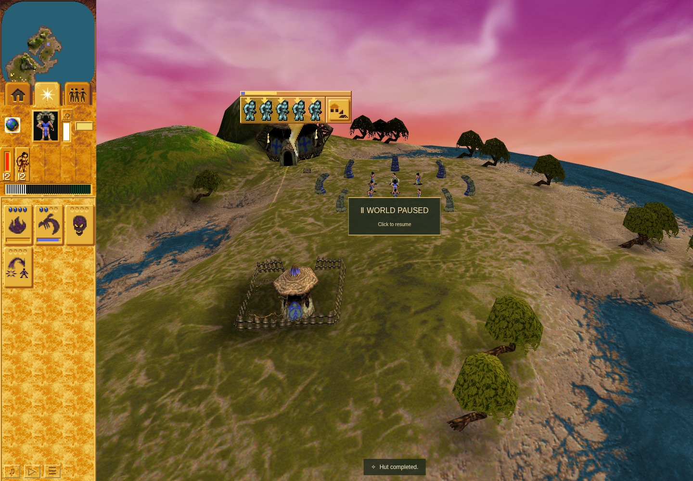
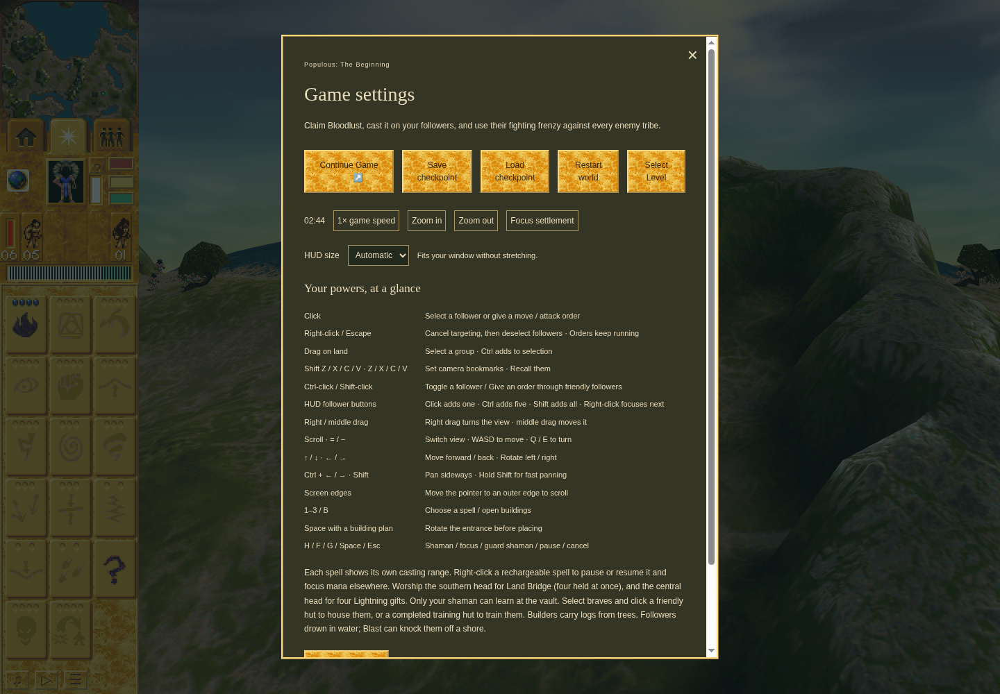

# Training ownership and Spy approach evidence — 7 October 2026

Related work: [PR262](https://github.com/JohnDeved/populous-new-dawn/pull/262), [PR264](https://github.com/JohnDeved/populous-new-dawn/pull/264).

**The ordinary Spy arrival/ignition gate remains open. These images and test results do not establish full original-game parity.**

## Current combined source and standard verification

The normal integration of both products and current main is `25c9e9f7ad8aa9acef2f8038bef6b9a71a68984e`, tree `2ac0e38fdd0e4494a3f03a8a563d1e96acb93cb9`. Its application tree is `6de5268d98dc27343f2ae497ff6680e8246c0607`.

All 253 standard test files ran once in eight sequential groups: 1,476 passed, zero failed/cancelled/skipped/todo. Typecheck, parity validation, orchestration validation and production build also passed. The twelve fresh bounded commands ran from 22:49:16.379 to 22:54:28.922 UTC. Independent review checked exact source before/after, raw output hashes, full file coverage and all explicit inputs. This is fresh equivalent standard coverage, with no prior-source test carry.

Aggregate SHA256: `62d2420be7e787044741166463b775d8c13646e2576b80fa546fdbae1a4bd29c`. Independent standard verdict SHA256: `993f7908d86bccf155b0426bcc88ada6578d6bdd19f5edd4ad7fd995eb8f951b`.

Earlier failed integration runs remain failed. Unchanged inherited product Oxlint findings (116) and parity-tooling ESLint findings (five) retain their failed tool statuses and independently accepted baseline attribution. This is not a clean-lint claim.

## Mission 3: ordinary shared training and checkpoint continuity

QA source `a3d3f2f92a7dc7e84f54f6ddac9f6c989b0ee435` used public Mission 3 entry, acquired Temple knowledge, built the school and assigned Braves312/309/519/513/300 to one command-8 record18 with five references. The genuine checkpoint at turn2890 retained those identities and shared ownership through ordinary Load. Ordinary group reassignment then released the training record. All six scenario stages passed. The failed redundant launcher precheck remains separately retained and its actual run admissibility was independently reviewed.

The screenshot shows the paused loaded boundary; the underlying observations establish the identities and ownership. It does not prove original timing, doorway throughput or conversion behavior.

## Mission 16: trained Spy Save, followed by failed approach

QA source `278b470489fb99681c788dbb57b5d6bc4fe3a228` used ordinary controls to build school340, train Brave112 into Spy394, and commit a checkpoint at turn1973. Full checkpoint SHA256: `c2f5aacc335c5e4b73f4d8e9edb40a79d073f5d7019a704a88e0f97ccfa9e5bb`.

Acquisition, Save and disguise passed. The later approach remained FAILED: the 436-sample passive trace kept command15 record55/ref1 and its goal through the last living Spy sample at2577, with10.6HP. The actor and registered person disappeared at2578; target3 remained intact. No qualifying arrival or ignition was observed. The exact damage source is unknown. The failed stage did not retain its exact pointer payload before failure; that limitation is not replaced by the observed command ownership.

Independent review verified the failed trace, preserved checkpoint, restored observer and owned browser/profile cleanup. Failed-attempt review SHA256: `35a95c61ede668086c0425667b17b61ed9aeb42e85bde8db10e202c2a76cbac9`. The earlier charging-helper failure also remains failed. The screenshot proves the rendered Save boundary, not Load or sabotage.

## Evidence boundaries

Both QA application trees match the combined product application. Their original QA source identities remain attached to the observations. These are sandboxed Chrome154.0.8037.92 software-WebGL functional captures, not native original-game pixels or hardware-performance measurements. Static original-source/data analysis and supplied-state component comparisons are separate evidence. No full original-game execution or complete gameplay-history equivalence is claimed.

Only this compact report and the two relevant game screenshots are published here. Private browser profiles, original game bytes and raw archives are excluded.
