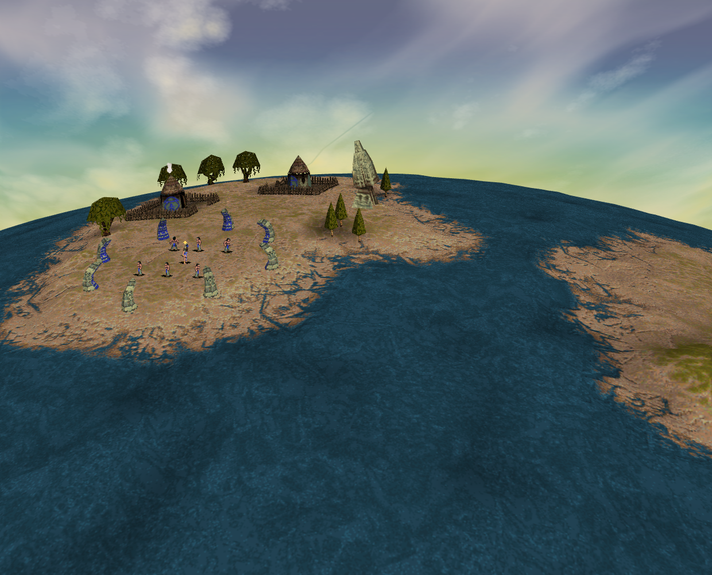
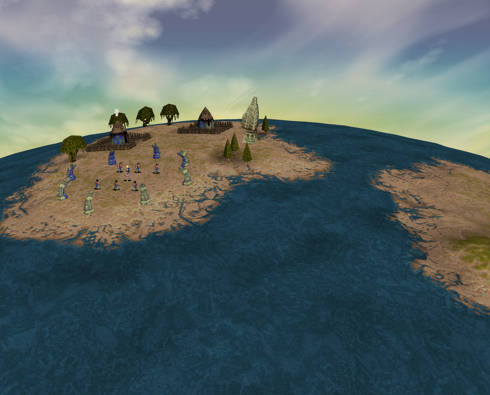
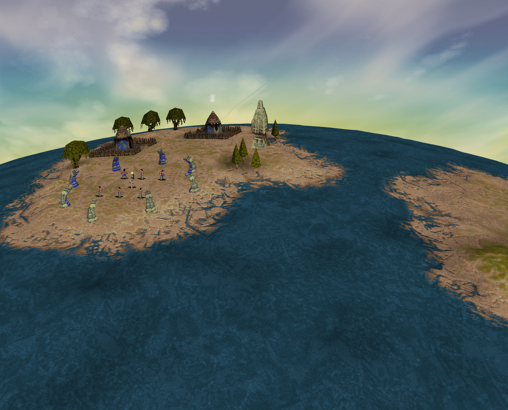
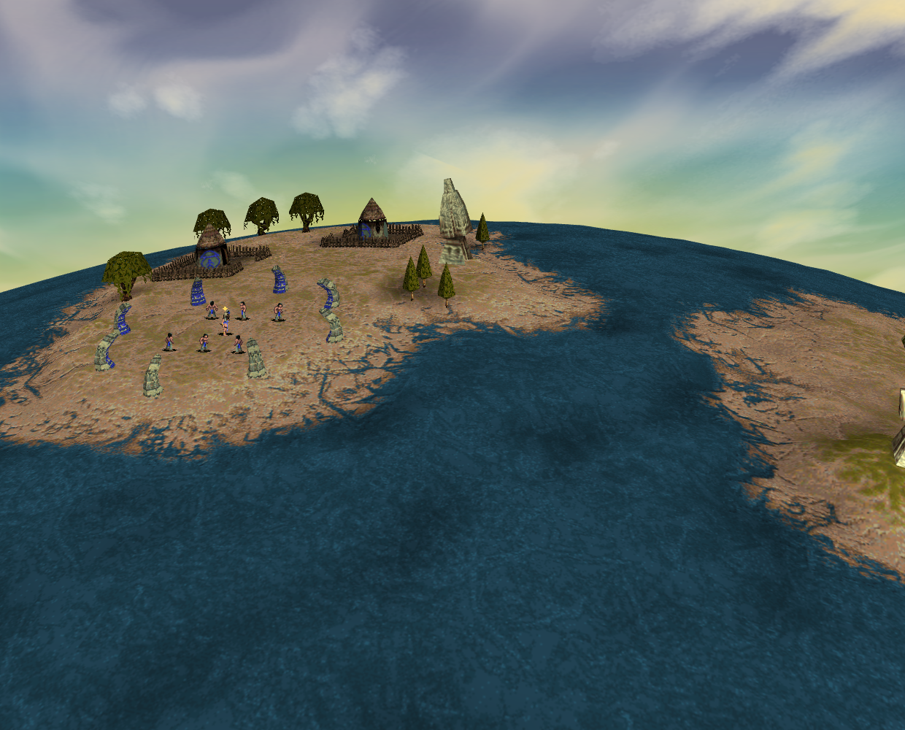

# Authored tree-hover evidence

Evidence for [PR #283](https://github.com/JohnDeved/populous-new-dawn/pull/283),
referencing [issue #19](https://github.com/JohnDeved/populous-new-dawn/issues/19).
**Candidate 03 passed its seven-phase scenario. Independent review accepted the
bounded ordinary tree-hover result and its correspondence to the before evidence.**

The accepted source change is limited to live scenery models 1–6 with logs >= 1:
the scene's hover descriptor fallback and the render caller's `point.id` match.
It reuses the existing neutral-owner 200/255 shading. Base application:
`2107ccfabc1737aed55aca3c5579a920dd63a667`; candidate application:
`1ec5bae0e1ed91b4ff30cd36556c9adde6a15252`.

The [retained original chain](https://github.com/JohnDeved/populous-new-dawn/blob/1ec5bae0e1ed91b4ff30cd36556c9adde6a15252/decomp/research/tree-hover.md) documents
scope, source provenance and limits. [summary.json](summary.json) records exact
receipt identities and hashes. Four selected natural PNGs are copied byte-for-byte;
raw logs, archives and runtime profiles are not included.

## Accepted source and standard evidence

| Check | Result and claim |
| --- | --- |
| Red 01, `c27c46c` | Failed the opening input-mask prerequisite. Retained; no product-regression credit. |
| Red 02, `c0d4f8b` | After actual campaign/flyby input unlock, the production picker found the authored tree and its highlight failed `0 !== 200`. Intended pre-fix failure. |
| Focused candidate | 8/8 passed across tree-hover, scene lifecycle and world-picking tests on exact `1ec5bae`. |
| Standard candidate | 1,595/1,595 passed across all 272 files, plus fresh typecheck, parity, orchestration and production build. All 16 stages finished with stable source. |
| Scoped quality | Oxfmt, ESLint, structural and context checks passed. Strict Oxlint **failed** with 19 findings: 17 warnings and two errors, byte-identical to main's baseline diagnostics. |
| Independent review | Source, standard results and bounded ordinary candidate/pixel evidence accepted. No remaining blocker within this tree-hover scope. |

The composed regression supplies texture IO, painter submissions, GPU and
unrelated frame boundaries. It is not an ordinary rendered gameplay witness.

## Ordinary witness status

Baseline attempt 01 used application `2107ccf` and QA head
`9dcee20c48e4ecf5c08823fdd16724572c79afc4`. It failed the declared-target prerequisite
with `Declared authored Mission1 targets unavailable`. Source diagnosis found that
QA compared DAT object 42's anchor coordinates (-12,34) to the Hut's normalized
runtime x/z. Separate actual-world feasibility checks show that
`addBuilding` produces runtime object 37 at (-11.0703125,33.0546875), with native
anchor (64512,54784). The same-object anchor correction was independently accepted
with 13 actual-world/405-turn feasibility contracts. Baseline 01 remains invalid
for product reproduction and supplies no completed hover or comparison credit.
Its live roster was not recorded, so that source diagnosis is not a recovered
runtime roster from the failed attempt.

Baseline 02 remains **FAILED overall** at its later Hut-control phase timeout.
Its application was `2107ccf`, QA head
`691c7d5e71961f157a34d4f73fcd0d8d61ef748b`. Independent review accepted eight natural
game-canvas PNGs, 96 original-render records and 14 trusted input events as bounded
before evidence:

- Authored tree 20, scenery model 1/render model 13, remained at uniform 0 through
  all four natural turn residues on initial hover and re-entry. Expected 200/255
  phase classes appeared in screenshot filenames; **measured baseline uniforms
  were 0**, not those suffix values.
- Trusted stationary-pointer pan, zoom/return and HUD leave worked. Each retained
  input's synchronous before/after selection, orders/ownership and RNG matched.
- The actual Blue Hut 37 was picked and naturally rendered once at uniform 255,
  followed by trusted same-coordinate canvas leave and zero-uniform renders.
  Only residue 3 was observed for this secondary control. Sustained four-residue
  canvas hover was unsupported by the existing occupancy-popup interaction;
  the exact intercepting DOM node was not recorded. The original scenario did
  not pass, and its failed status must remain visible.

Candidate 03 is terminal **PASSED**, using QA head
`e18fddfe35ad5424b580f7a07fbd058590d32f72` with application files identical to
accepted source `1ec5bae`. Its seven completed phases retain 30 natural renders
and 14 trusted input events. Tree 20/render model 13 receives 200 and 255 across
all four natural turn residues on hover and re-entry, then 0 after leave. The
camera pan/zoom and the bounded Hut pick/render/leave control also complete. The
Hut control policy differs from baseline 02 only by accepting one real natural
phase followed by actual canvas leave/zero; the tree's four-residue requirement
is unchanged. Baseline 02's overall failed result remains retained.

The material applies `highlight / 255` to the original texture, replaces ordinary
diffuse lighting and suppresses additive light. It produces a textured brightness
pulse, not a uniformly white tree. Independent pixel review localized the target
as the rightmost of the three conifers near the obelisk. Page pointer (826,374)
maps to canvas (626,374) after the 200-pixel HUD offset.

Each initial-view comparison (before→200, before→255, 200→255) changes 784 pixels
within inclusive canvas bounds [613,360,637,422]. RGB at (626,374) is baseline (43,53,0), phase 200
(36,44,0), and phase 255 (45,56,0). In the returned view, bounds are
[599,359,623,421] inclusive, with RGB at (612,373) of phase 200 (42,46,0), phase 255
(54,59,0), and after leave (51,55,0). The returned 200→255 and 255→leave comparisons
change 780 and 779 pixels respectively. These are independently accepted localized
browser observations; they do not establish exact original-game pixels.

## Selected unchanged natural frames

All four PNGs are 1240×1000 game-canvas frames from sandboxed Chrome Headless Shell
154.0.8037.92, with SwiftShader software rendering. The viewport is 1440×1000 at
DPR 1. These are browser frames, not original-game reference images or hardware
performance evidence. The after-leave frame follows the camera-return sequence
and has a slightly different view; it is a cleanup witness, not an aligned pixel
difference against the initial-hover frames.
SwiftShader/WebGL, readPixels-stall and two Three missing-image warnings were
retained; browser errors were empty. The captures do not prove whole-page/compositor
or audio behavior.

Before: app `2107ccf`, QA `691c7d5`, turn 458, render ordinal 5. The tree is picked
but its actual uniform is **0**; the original filename's 255 suffix denotes the
expected phase. Baseline 02 remains failed overall at its later control timeout.

After, darker pulse phase: app `1ec5bae`, QA `e18fddf`, turn 449, render ordinal 3,
actual uniform **200**.

After, lighter pulse phase: the same app/QA, turn 454, render ordinal 5, actual
uniform **255**.

After HUD leave: the same app/QA, turn 605, render ordinal 38, pointer and hover
cleared, tree uniform **0**.

The broader issue #19 remains open. This slice does not establish full original
controller/modal behavior, tooltip parity,
native whole-frame pixels/timing, hardware performance or additional parity credit.
