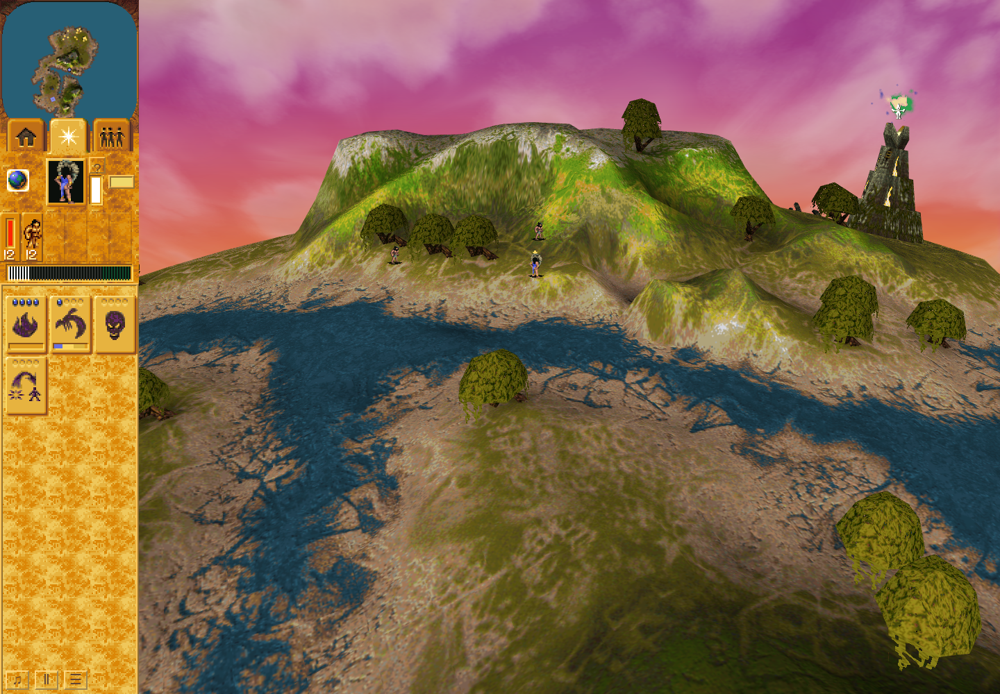

# Ordinary Mission 3 Erosion: actual-input native controller replay

The browser's **64 actual Erosion calls matched the original native routines** `0050ff30 → 004983a0` for every one of the 16,384 landscape heights, simulation RNG, countdown/liveness and terrain-notification cells. Both explicitly selected sound-suppression-bit settings (`0` and `0x10`) passed: 128 emulated routine calls in total. No original OS binary was launched.

This is a per-call controller comparison from an ordinary live browser activation. Each native call restores that call's recorded browser inputs. It is not a continuous original-game simulation. Other game work can change terrain/RNG between calls.

## Ordinary evidence

- Source: [b3285f6b0559799197a83ed970c5df529481ec73](https://github.com/JohnDeved/populous-new-dawn/tree/b3285f6b0559799197a83ed970c5df529481ec73); app tree `84d4a529d361106feb3f760917a71b247e1c0c25`.
- Run `cdc3e4be-2980-4557-8322-29e0f241b4b9`; fresh task-owned profile; public Mission 3 startup and one original living Blue Shaman 46 worship dispatch to authored head 101.
- Prospective arm at turn 155; trusted delivered pointer pair/order27 at 172; that original actor's arrival and qualifying work observed at 535. No extra worship dispatch, replacement actor, helper-created World, seeded effect or clock forcing.
- Actual effect 3155: constructor 64, immediate first call and first afterTurn 63 at 688, then all 64 calls through zero/removal at 751. 98 distinct native landscape cells changed within the observed controller calls. Shaman 46 remained alive at HP 100.
- [Terminal browser receipt](browser/receipt.json) SHA256 `f1f3b953c1f99e8e08ea8d66dcccf49ede643ac0b8ba9f798b4ec55448f8ed3f`: passed, errors empty, source/runtime unchanged, cleanup and continuation verified.
- Exact [captured inputs](browser/capture.json), [lifecycle](browser/lifecycle.json), [delivered input archive](browser/inputs.json), and [eight actual parsed module bodies](browser/modules.json) are linked to that terminal receipt. The reviewed launch command, compiler/server/browser identity and source-map correspondence are retained. Source maps alone are not authenticity proof.

The screenshot is the actual page after retirement; it is not a before/after native-render comparison.

## Native result

[Native command receipt](native/receipt.json) SHA256 `ca6c5e23b8ac5440f2ab5c0d26522f369c7ad526afe4de6fe56154dad27d2762`; [raw result](native/result.json) SHA256 `e643fff656a8a6e3ed4dd2d8cfc0db9aa96fb80ffeb73b27504d6920b47f32d7`. The run passed on CPU 4 in 1.635 seconds under a 60-second outer cap and 3,000,000 instructions per call. The canonical EXE bytes were SHA256 `3a5065c7420b3fcde208bf220bc86dfbac95e025ab2492caf9c7ea5308dfbe4f`.

Both settings produced 63 queue/terrain notification pairs and one retirement. The selected clear sound bit produced 63 intercepted sound calls; the selected set bit produced none. These are selected replay policies, not a finding about actual native audio cadence.

The [maintained checker](https://github.com/JohnDeved/populous-new-dawn/blob/b3285f6b0559799197a83ed970c5df529481ec73/scripts/check-native-erosion-capture.py) requires externally pinned terminal receipt/source/run identities before native imports. [Validation-only admission](validation/receipt.json) passed first. The exact native argv and all input hashes are in the command receipt and [admitted plan](native/plan.json).

## Limits and retained failures

Sound `0048a050`, terrain queue `0044ddf0`, notification `0044f2f0` and deletion `004edcf0` are intercepted boundaries. Actual native sound lifecycle/cadence, downstream queue/walk-mask/object/render consumers, full engine timing, and UI/IndexedDB restore are not established. The separate earlier [supplied-state authored producer/scheduler proof](https://github.com/JohnDeved/populous-new-dawn/issues/223) establishes the bounded immediate first-call and cached-next scheduling distinction under its supplied inputs. This new actual-game capture/replay establishes per-call terrain/RNG/controller/notification equivalence. Neither evidence stream is a full original-game run; this replay alone does not establish native activation scheduling. No general FPS parity is claimed.

The earlier effect 3322 observation lacked full per-step heights/RNG and was not reconstructed or reused. Retained failed attempts remain failures: [CLI import cycle](failures/import-cycle/command-receipt.json), [initial scene-binding timeout](failures/scene-binding/receipt.json), and [Skip completion wait](failures/skip-completion/receipt.json). Their preserved outcomes led to the reviewed setup fixes; they are not counted as successful capture evidence.

Independent review accepted both the actual capture and this bounded native replay result, including all 128 recorded calls and their pinned input/EXE/script identities. [Manifest](manifest.json) lists exact immutable packet bytes. Profiles, original executable, package trees and tool assets are excluded.
