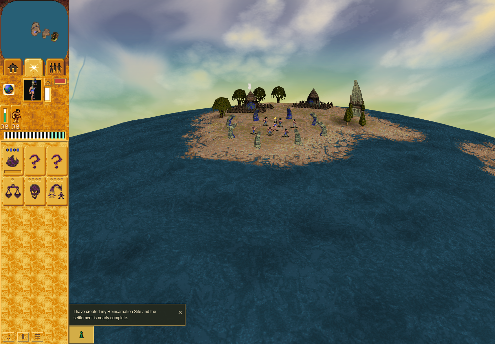
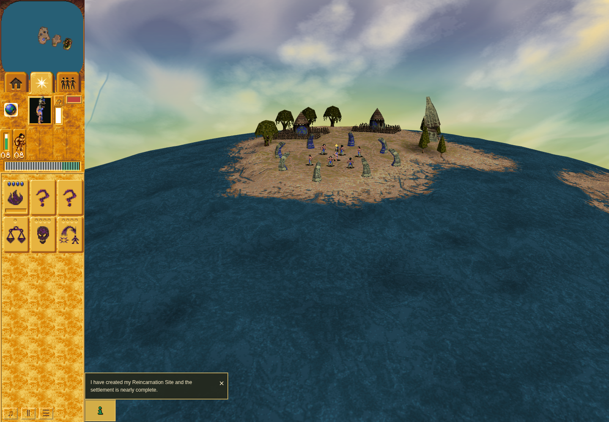
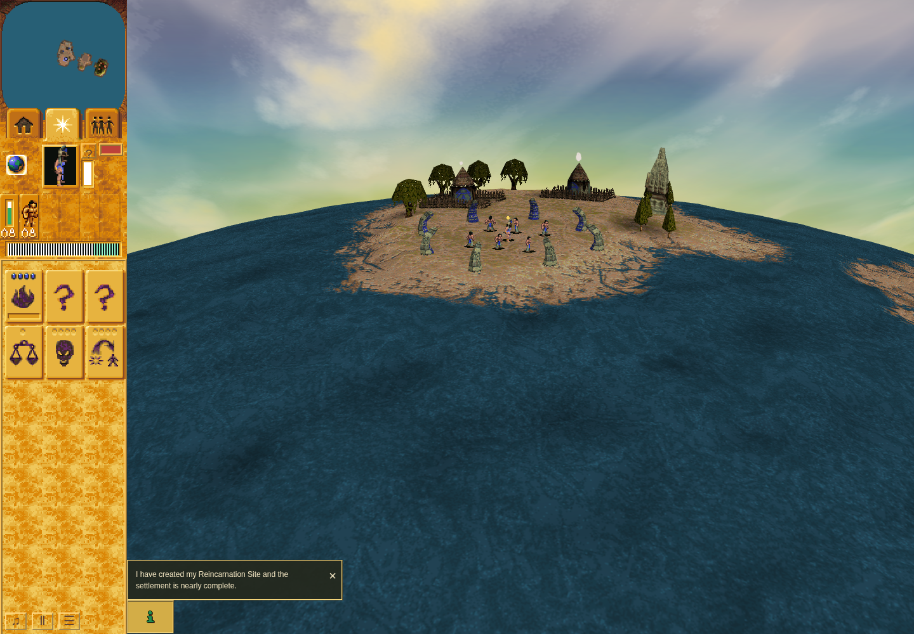
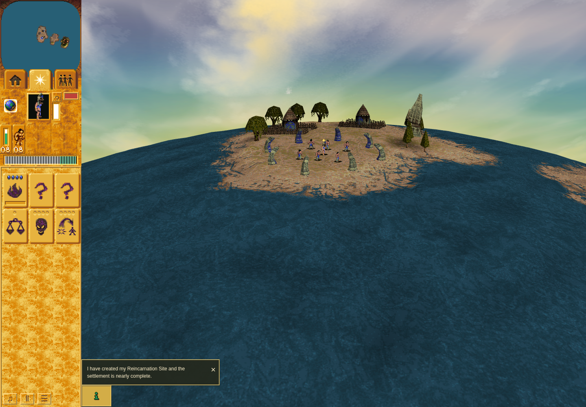

# PR218: ordinary model45 Stone Head baseline and candidate

The same pure ordinary Mission1 observation exposes the missing logical-visit
gate on **3cc9e830** and passes the frozen repaired-body predicate on **d97c370**.
Both runs use the same22-second opening/1×/2×/pause/resume controls, with no worship,
camera manipulation, state injection or extra game render.

The genuine tall gray Bridge body is visible at the right of the Blue settlement
in both runs' opening and2× images, distinct from the reincarnation stones.
Raw identity is **shrine29, trigger30/scenery32, family45/nativeModel45** at
**x−5,z25**; existing group position/matrix translation is **(−5,0.5078125,25)**.
Queued-face records are liveness aids; actual screenshot review establishes pixel
visibility. Stills alone do not establish cadence.

| Frozen repair-predicate failures | Baseline3cc | Candidated97 |
| --- | ---: | ---: |
| Missing gate bit |616|0|
| Logical-turn stamp mismatch |426|0|
| Ordinary morph cadence mismatch |298|0|
| Advance without a logical turn |54|0|
| Geometry/UV/control mismatch or missing interval |0|0|

The candidate retains f1/f2/stamp during **30 sampled visible-body
extra-presentation intervals** and matches **440 logical stamp/cadence pairs**.
Its **646 six-vertex/UV geometry samples** match the pinned source data. The actual
visible bridge supplies323 queued enabled samples and220 logical intervals,
with18 distinct sampled geometries at both1× and2×. The second stored body is not
claimed as a pixel-visible witness. These are independent sparse RAF captures,
not equal-size samples or a performance comparison.

Only **six predetermined vertices**, six UV pairs and six material-mode entries
are sampled per body. Even though all18 phase values occur naturally, this is not
the controlled fixture's exhaustive full-geometry assertion. Held/refill/restore,
other native families, Vault/HFX and broader gameplay remain in their separate
evidence scopes. See the [full bounded report](report.md) and the independently
published [native model45 gate packet](https://github.com/JohnDeved/populous-new-dawn/blob/e76091766dd2db9d21b6d28ba2075f77a99284df/stone-head-logical-gate/findings.md).

## Genuine ordinary screenshots

Exact sources: baseline`3cc9e830d2e7d2aa9844e8104fa51017d65dd171` and
candidate`d97c370da3e996e00130610df97d10b827ab5c4b`. Both use official sandboxed
Chrome154/SwiftShader at1440×1000/DPR1. No unsafe renderer/sandbox flags were used.

| Baseline ordinary1× | Candidate ordinary1× |
| --- | --- |
|  |  |

| Baseline shipped2× | Candidate shipped2× |
| --- | --- |
|  |  |

The [baseline visual identity note](baseline-3cc/visual-review.json) and
[candidate terminal/visual note](candidate-d97/terminal.json) bind images to the
same ordinary stage's raw body position. They do not pretend the screenshot is
the exact final sampled clock instant. Console errors are absent; retained logs
include software-WebGL/ReadPixels and texture-image warnings.

## Exact inputs and offline reproduction

[Observer](observe-stone-head-visits.mjs) SHA256
`febd084f136389ad254ce04b9a96ec133cdc1bfdfc9b18346d99b4f159a8af01`;
[analyzer](analysis/analyze-stone-head-visits.py) SHA256
`8d2db8452e04e3ad1ae88b83f4878fd1323cb54a7233e09e31f0deda28f84d98`.
The same bytes are used on both raw captures. Source preflight and the bounded
observer delta from cb57bd7 are retained.

The raw rows are losslessly gzip-compressed with deterministic headers. Their
decompressed SHA256 values remain those in the original receipts. Run from this
evidence checkout with a local game Git checkout containing both source commits:

```sh
python3 stone-head-pr218/analysis/reproduce.py /path/to/game-git-checkout
```

The wrapper verifies exact input bytes, extracts rows only into a private
temporary directory, invokes the frozen offline checker, and requires the expected
baseline exit1 and candidate exit0 plus byte-identical saved reports. No game,
browser, dependencies or original/tool binaries are used. The baseline failure
remains the deliberate negative control, never a candidate pass.

[Baseline negative control](baseline-3cc/stone-head-repair-negative-control.json)
and [candidate pass](candidate-d97/stone-head-attribution.json) retain exact counts,
hashes, source/eligibility exclusions and sampling limits. Each directory also
contains original command/raw streams, inner receipt, corrected launcher cleanup,
genuine screenshots and terminal session evidence.

Baseline session93342 and candidate50565 each exited0; source/input bytes stayed
stable. The same-launcher success path requires inner passed status without
failure plus separately closed IPv4/IPv6 port4374. Dependency925605 was exclusively
loaned and returned with matching locks and two-ended receipts. After the ordinary
candidate, ownership was released to the author for the separately controlled
4318 fixture. Profiles, caches, dependencies and game/tool/authentication inputs
are excluded. This packet does not claim original-OS cadence, hardware performance
or full Stone Head/scenery parity.
